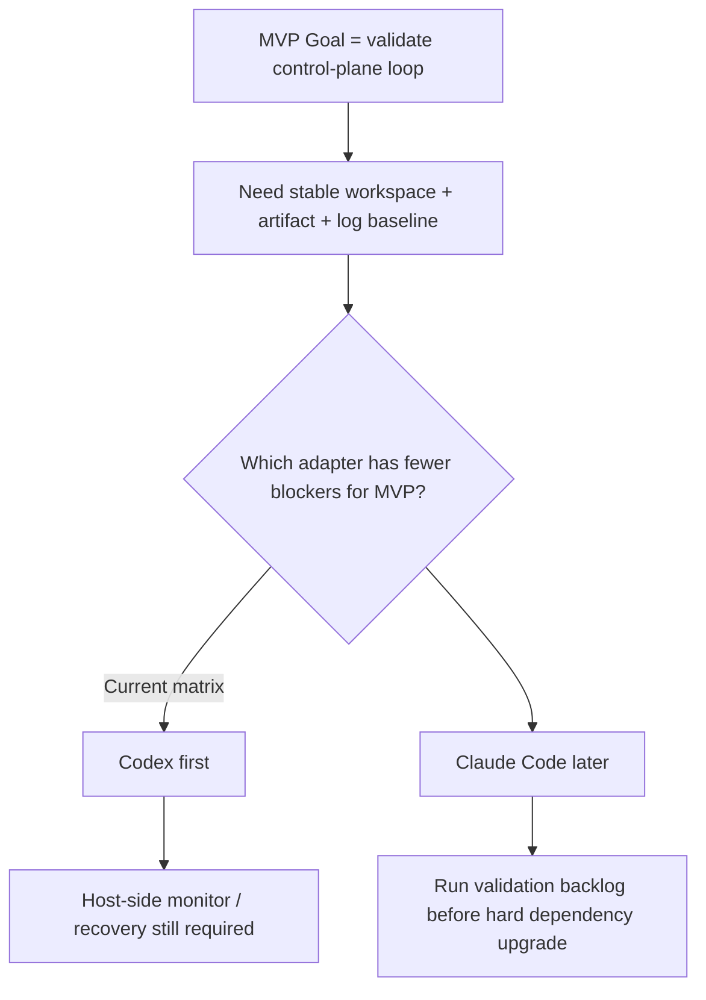

# 13 First Executor Profile

## Purpose

- 为 Hive MVP 明确首个执行器适配选择。
- 在 Claude Code 与 Codex 之间收敛 first implementation choice。
- 说明哪些能力可依赖，哪些能力仍必须由 host-side Orchestrator 兜底。

## Scope

- 本文只决定 MVP 的首适配器优先级，不宣称能力已全部验证。
- 能力证据仍以 `09-Executor-Capability-Matrix.md` 与 `12-Executor-Validation-Plan.md` 为准。
- 本文不扩展 executor adapter contract。
- vNext 的多角色拓扑与 `Run Contract` 模板见 `15-Agent-Role-Topology-and-Run-Contract.md`；这不改变当前 MVP 的单 adapter profile 收敛。

## Definitions

- `Primary First Adapter`：MVP 首个必须落地并用于控制平面闭环验证的 adapter。
- `Secondary Later Adapter`：在 MVP 闭环稳定后再接入的第二适配器。
- `Host-side Guardrail`：必须由 Hive 控制平面而非执行器原生能力提供的保护与恢复逻辑。

## Recommended MVP Choice

- `Primary First Adapter`：`Codex`
- `Secondary Later Adapter`：`Claude Code`

## Why Codex Is the Recommended First Adapter

### 1. 已文档化的 workspace / sandbox 边界更适合 MVP

根据当前 capability matrix：

- `supports_workspace_isolation`
  - Codex：`yes`
  - Claude Code：`partial`

对 MVP 的意义：

- 首版要验证 path lock、workspace isolation、dispatch -> run -> handoff -> acceptance 闭环。
- 当 workspace 边界更明确时，首版更容易把冲突控制与 artifact 收集做稳定。

### 2. artifact / log 归一化入口更接近 MVP 需要

根据当前 capability matrix：

- `artifact collection model`
  - Codex：`yes`
  - Claude Code：`partial`
- `log collection model`
  - Codex：`yes`
  - Claude Code：`partial`

对 MVP 的意义：

- Acceptance Engine 与 Recovery Coordinator 需要稳定读取 logs、artifacts、test results。
- 首版不应该先在“如何把原始执行结果拉出来”上消耗过多适配成本。

### 3. 已知未知项更少

根据当前 capability matrix 的总结：

- Claude Code 的 `known unknowns`：高
- Codex 的 `known unknowns`：中高

这不等于 Codex “更强”，而是表示：

- 对首版必须落地的 workspace / artifact / log / parallel baseline 来说，Codex 当前文档化边界更少阻碍。
- 对首版不应依赖的 restore / soft cancel / built-in heartbeat，两者都还需要保守处理。

### 4. 更符合 MVP 的“先验证控制平面闭环”目标

MVP 当前要证明的是：

- change-set / outbox 是否稳定
- dispatch / lease / timeout / recovery 是否稳定
- handoff / acceptance / checkpoint 是否稳定

因此首适配器应优先减少以下不确定性：

- workspace 隔离不清
- artifact / log 采集面不稳定
- 并发运行基线不明确

Codex 在这些点上的文档化信号更适合首版。

## Why Claude Code Is Recommended as the Secondary Later Adapter

- Claude Code 仍应保留为重要后续适配目标。
- 但在当前 matrix 下，以下未知项更适合放到第二阶段验证：
  - restore fidelity
  - hard kill / soft cancel fidelity
  - workspace isolation depth
  - interactive / runner log normalization
- 这意味着 Claude Code 不被排除，只是不应成为 MVP 的 first dependency。

## MVP Binding Profile for Codex

说明：

- 当前推荐 `Codex` 作为 first adapter，解决的是“先让哪一个外部执行器接入 Hive 控制平面”的问题。
- 这不意味着 vNext 每个角色都要绑定不同 adapter。
- 在当前阶段，Planner / Research / Execution / Evaluator 这些角色即使逐步成型，也仍可以先复用同一个 adapter profile，由控制平面通过不同 `Run Contract` 区分职责。

### 首版可以依赖的能力

首版可将以下能力作为保守 hard dependency：

- `supports_parallel_runs = yes`
- `supports_workspace_isolation = yes`
- `approval / permission model = yes`
- `artifact collection model = yes`
- `log collection model = yes`
- `failure surface = documented`

### 首版不得依赖的能力

首版仍必须把以下项视为未确认硬能力：

- `supports_restore_run`
- `supports_soft_cancel`
- `heartbeat source`
- 细粒度 `tool introspection` 语义

换句话说，首版即使先接 Codex，也仍必须坚持：

- recovery 默认走 `rehydrate + reassign`
- heartbeat 由 host-side monitor 主导
- supersession 默认允许退化为 hard stop + partial handoff 回收
- capability match 先按 coarse profile 做

## Host-side Responsibilities That Remain in Hive

以下能力必须继续由 Hive 控制平面兜底，不能交给 Codex 或 Claude Code 原生行为推断：

- authoritative object state 更新
- dispatch idempotency 与 duplicate dispatch prevention
- path lock 与 stale lock recovery
- start SLA、lease、heartbeat timeout 检测
- handoff ingest 与 acceptance
- checkpoint writing
- recovery coordination
- replay safety 与 side effect token 审计

## Adapter Implementation Rules for MVP

首版 `codex` adapter 必须至少实现：

- `get_capability_profile()`
- `launch_run(...)`
- `poll_run(...)`
- `collect_logs(...)`
- `collect_artifacts(...)`
- `cancel_run(...)`
- `kill_run(...)`

首版 `codex` adapter 可以先降级实现：

- `restore_run(...)`

降级规则：

- 若无法提供 run-fidelity restore，则必须显式返回 unsupported 或 best-effort。
- 不得伪装为“已恢复原 run”。

## Relationship to Executor Validation Plan

本文的选择与 `12-Executor-Validation-Plan.md` 的关系是：

- 它决定 MVP 先做哪个 adapter。
- 它不跳过验证计划。
- 验证计划完成前，仍不得把 restore、soft cancel、built-in heartbeat 升级为 hard dependency。

特别要继续验证的 Codex 项：

- restore fidelity
- soft cancel semantics
- heartbeat observability
- tool introspection granularity

## Mermaid Diagram

### First Adapter Decision

## Anti-patterns

- 因为要“中立”就不做 first adapter choice。
- 因为 Codex 先接入，就假设 live restore、soft cancel、heartbeat 都已稳定。
- 把 Claude Code 写成“不可支持”而不是“后续适配”。
- adapter 直接承担 acceptance、checkpoint、recovery 决策。

## Acceptance Criteria

- 读者能明确知道首版推荐 `Codex` 作为 first adapter。
- 读者能明确知道该建议基于哪些已文档化能力，而不是基于臆测。
- 读者能明确知道哪些能力仍必须由 host-side Orchestrator 兜底。
- 本文结论与 capability matrix 和 validation plan 不冲突。
