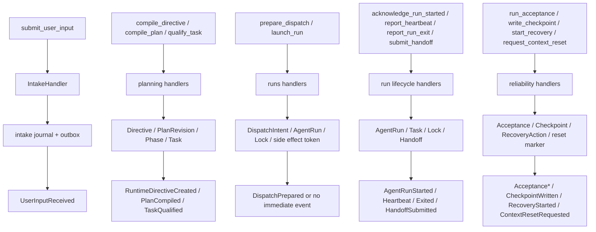

# 14 Command Handler Mapping

## Purpose

- 把 command contract 收敛成可直接实现的 handler 设计。
- 明确每个 command 的 owning handler、读写对象、outbox events、side effect、锁要求、幂等键和恢复 ownership。
- 给工程师一个能直接对应到代码文件和 change-set 的命令执行地图。

## Scope

- 本文只覆盖首版 MVP command surface。
- command 的输入 envelope 和语义仍以 `11-Control-Plane-API-Contract.md` 为准。
- 对象字段最小集以 `../03-state-model/07-MVP-Object-Package.md` 为准。
- 本文不规定 HTTP / gRPC / CLI 传输层，只规定 handler 语义和 change-set 落点。

## Definitions

- `Owning Handler`：唯一负责该 command 前置条件、state mutation、outbox 构造和失败语义的实现单元。
- `Read Set`：handler 在构造 change-set 前必须读取的 authoritative objects。
- `Write Set`：handler 在同一 change-set 中必须写入或更新的对象集合。
- `Side Effect Token`：用于记录外部动作是否已经请求、是否需要 reconcile 的 durable token。
- `Recovery Owner`：在 command 成功不完整、回调缺失或执行歧义时负责接管恢复的组件。

## Rules

### 通用设计规则

1. 每个 command 只能有一个 owning handler。
2. 所有 authoritative state mutation 必须通过 `ChangeSet Applier`。
3. handler 只能在 transaction 中写 `outbox_events`，不能直接写 `event_log`。
4. 只有 `launch_run` 这一类外部动作命令，允许在 commit 之后调用 adapter。
5. `reconcile_once` 负责调度其他 handler，不得绕过它们直接修改最终业务状态。

### command -> handler -> state mutation -> event emission

| Command | Owning Handler | State Mutation | Emitted Events |
|---|---|---|---|
| `submit_user_input` | `IntakeHandler` | 追加 intake journal、写幂等记录；不改核心对象 | `UserInputReceived` |
| `compile_directive` | `DirectiveCompilerHandler` | 创建或更新 `Directive` | `RuntimeDirectiveCreated` |
| `compile_plan` | `PlanCompilerHandler` | 写 `PlanRevision`、`Phase`、`Task(draft)`，必要时 supersede 旧 revision / task | `PlanCompiled`、`PlanRevised`、`TaskCreated` |
| `qualify_task` | `TaskQualificationHandler` | `Task.draft -> ready`，或 `Task.draft -> blocked` 并创建 `Issue` | `TaskQualified` 或 `TaskBlocked` |
| `prepare_dispatch` | `DispatchPreparationHandler` | `Task.ready -> dispatching`、`DispatchIntent.prepared`、`AgentRun.created`、`Lock.reserved` | `DispatchPrepared`、`LockAcquired` 或 `LockConflictDetected` |
| `launch_run` | `RunLaunchHandler` | 只写 `DispatchIntent.launch_requested`、`AgentRun.starting`、side effect token / reconciliation marker | 无立即事件 |
| `acknowledge_run_started` | `RunLifecycleHandler` | `AgentRun.starting -> running`、`Task.dispatching -> dispatched`、`Lock.reserved -> active`、`DispatchIntent.acknowledged` | `AgentRunStarted`、`TaskDispatched`、`LockAcquired` |
| `report_heartbeat` | `RunLifecycleHandler` | 刷新 `AgentRun.last_heartbeat_at`、`lease_expires_at` | `AgentRunHeartbeatReported` |
| `report_run_exit` | `RunLifecycleHandler` | `AgentRun.running/starting -> exited/start_failed/timed_out`，必要时 `Lock.active -> recovery_hold/released` | `AgentRunExited`、`AgentRunStartFailed`、`LockReleased` |
| `submit_handoff` | `HandoffIngestHandler` | 创建 `Handoff`、绑定 `AgentRun.handoff_ref`、`Task.dispatched -> awaiting_acceptance` | `HandoffSubmitted` |
| `run_acceptance` | `AcceptanceHandler` | 创建 `Acceptance`、更新 `Task`、释放 `Lock`、必要时创建 `Issue` 或 followup `Task` | `AcceptancePassed`、`AcceptanceRejected`、`AcceptanceNeedsFollowup`、`AcceptancePartiallyAccepted`、必要时 `LockReleased` |
| `write_checkpoint` | `CheckpointHandler` | 创建新 `Checkpoint`、supersede 旧 checkpoint | `CheckpointWritten` |
| `start_recovery` | `RecoveryHandler` | 创建 `RecoveryAction`、冻结相关 `Task / AgentRun / Lock`，必要时 requeue 或 block | `RecoveryStarted`、`LockRecoveryHeld`、必要时 `TaskRequeued` / `TaskBlocked` |
| `reconcile_once` | `ReconcileHandler` | 不直接写最终业务状态；按顺序调度其他 handler | 由被调度 handler 发出 |
| `request_context_reset` | `ContextResetHandler` | 写 reset request marker；不修改最终任务结论 | `ContextResetRequested` |

### command -> read set -> side effect -> lock -> idempotency -> recovery owner

| Command | Read Set | External Side Effect | 是否需要锁 | 幂等键计算 | Recovery Owner |
|---|---|---|---|---|---|
| `submit_user_input` | source registry、idempotency record | 否 | 否 | `input:{source}:{content_hash}:{time_bucket}` | 调用方重试 / `IntakeHandler` |
| `compile_directive` | intake journal、active `PlanRevision`、open `Task` / `Phase` | 否 | 否 | `directive:{raw_input_ref}` | `ReconcileHandler` |
| `compile_plan` | `Directive`、active `PlanRevision`、open `Task` set | 否 | 否 | `plan:{directive_id}:{base_revision_id}` | `ReconcileHandler` |
| `qualify_task` | `Task`、`Phase`、`PlanRevision`、task admission rules | 否 | 否 | `qualify:{task_id}:{task_version}` | `ReconcileHandler` |
| `prepare_dispatch` | `Task`、`PlanRevision`、active `Lock`、active `AgentRun`、executor profile | 否 | 是，预留 path lock | `dispatch:{task_id}:{plan_revision_id}` | `RecoveryHandler` |
| `launch_run` | `DispatchIntent`、`AgentRun`、`Task`、reserved `Lock` | 是，adapter launch | 否，依赖已预留锁 | `launch:{dispatch_intent_id}:{launch_attempt}` | `RecoveryHandler` |
| `acknowledge_run_started` | `DispatchIntent`、`AgentRun`、`Task`、reserved `Lock` | 否 | 是，激活已预留锁 | `start_ack:{run_id}:{adapter_run_ref}` | `RecoveryHandler` |
| `report_heartbeat` | `AgentRun` | 否 | 否 | `heartbeat:{run_id}:{reported_at}` | `LeaseMonitor` / `RecoveryHandler` |
| `report_run_exit` | `AgentRun`、`Task`、`DispatchIntent`、active `Lock` | 否 | 是，决定 release / recovery hold | `run_exit:{run_id}:{exited_at}` | `RecoveryHandler` |
| `submit_handoff` | `AgentRun`、`Task`、artifact refs | 否 | 否 | `handoff:{run_id}:{handoff_digest}` | `AcceptanceHandler` |
| `run_acceptance` | `Task`、`AgentRun`、`Handoff`、`Issue`、artifact refs、validation results | 否 | 是，决定 release | `acceptance:{handoff_id}:{acceptance_policy_ref}` | `RecoveryHandler` / `ReconcileHandler` |
| `write_checkpoint` | active `Directive`、`PlanRevision`、`Phase`、open `Task`、active `Run`、active `Lock`、open `Issue`、event cursor | 否 | 否 | `checkpoint:{plan_revision_id}:{event_cursor}` | `ReconcileHandler` |
| `start_recovery` | `RecoveryAction` backlog、latest `Checkpoint`、相关 `Task / Run / Lock / Issue` | 否 | 是，进入 `recovery_hold` | `recovery:{anomaly_correlation}` | `RecoveryHandler` |
| `reconcile_once` | pending events、acceptance backlog、recovery backlog、ready tasks、active runs | 否 | 否 | `reconcile:{event_cursor_window}:{cycle_seq}` | `ReconcileHandler` |
| `request_context_reset` | latest `Checkpoint`、pending high-priority blockers | 否 | 否 | `context_reset:{checkpoint_id}:{reason}` | `ReconcileHandler` |

### 哪些 command 必须在同一 change-set 内完成

以下命令在首版中必须做成单一 change-set，不允许拆成多次 best-effort 写入：

- `compile_directive`
  - `Directive` + `RuntimeDirectiveCreated`
- `compile_plan`
  - `PlanRevision` + `Phase` + `Task(draft)` + supersession mapping + outbox
- `qualify_task`
  - `Task` 资格结论 + `Issue`（若阻塞）+ outbox
- `prepare_dispatch`
  - `Task.dispatching` + `DispatchIntent.prepared` + `AgentRun.created` + `Lock.reserved` + outbox
- `acknowledge_run_started`
  - `AgentRun.running` + `Task.dispatched` + `Lock.active` + `DispatchIntent.acknowledged` + outbox
- `submit_handoff`
  - `Handoff` + `AgentRun.handoff_ref` + `Task.awaiting_acceptance` + outbox
- `run_acceptance`
  - `Acceptance` + `Task` 结论 + `LockReleased` + `Issue / followup Task` + outbox
- `write_checkpoint`
  - 新 checkpoint + 旧 checkpoint superseded + outbox
- `start_recovery`
  - `RecoveryAction` + freeze / requeue / block 相关对象 + outbox

### 哪些 command 只能产生 side effect token，不能直接改最终状态

首版只有以下命令属于该类别：

- `launch_run`
  - 可以写 `DispatchIntent.launch_requested`
  - 可以写 `AgentRun.starting`
  - 可以写 `external_side_effects` token 和 `reconciliation_markers`
  - 不能直接把 `AgentRun` 写成 `running`
  - 不能直接把 `Task` 写成 `dispatched`
  - 最终运行状态必须等待 `acknowledge_run_started`

### 失败恢复所有权

- `IntakeHandler`
  - 只负责同步提交；失败由调用方重试
- `RunLaunchHandler`
  - 只负责写 token 并调用 adapter；无 ack、launch ambiguity、start SLA 超时由 `RecoveryHandler` 接管
- `RunLifecycleHandler`
  - 心跳缺失、退出歧义、start_failed 之后的 requeue/block 由 `RecoveryHandler` 接管
- `AcceptanceHandler`
  - rejection / needs_followup 不直接重派，交给 `RecoveryHandler` 或 `ReconcileHandler` 决定后续路径
- `ReconcileHandler`
  - 负责统一扫描 backlog 并调度其他 handler，不接管外部 side effect 歧义

## Design Notes

### 推荐 handler 文件落点

- `packages/intake/handlers/submit_user_input.ts`
- `packages/directives/jobs/compile_directive.ts`
- `packages/planning/jobs/compile_plan.ts`
- `packages/planning/jobs/qualify_task.ts`
- `packages/runs/jobs/prepare_dispatch.ts`
- `packages/runs/jobs/launch_run.ts`
- `packages/runs/handlers/acknowledge_run_started.ts`
- `packages/runs/handlers/report_heartbeat.ts`
- `packages/runs/handlers/report_run_exit.ts`
- `packages/runs/handlers/submit_handoff.ts`
- `packages/acceptance/jobs/run_acceptance.ts`
- `packages/checkpointing/jobs/write_checkpoint.ts`
- `packages/recovery/jobs/start_recovery.ts`
- `packages/runtime/jobs/reconcile_once.ts`
- `packages/runtime/jobs/request_context_reset.ts`

### command -> handler -> state mutation -> event emission

### 和 change-set / outbox 的边界

- handler 负责 read set、guard checks、delta 计算。
- `ChangeSet Applier` 负责事务提交和幂等写入。
- `OutboxPublisher` 只负责 `pending -> published`，不推导状态。
- `RecoveryHandler` 只消费 marker 和 backlog，不直接代替其他 handler 执行主路径命令。

## Anti-patterns

- `prepare_dispatch` 和 `launch_run` 混在一个 handler 里，导致 commit 前就触发外部 side effect。
- `reconcile_once` 直接写 `Task.accepted` 或 `Task.blocked`，绕过 owning handler。
- callback handler 收到 `report_run_exit` 后顺手做 acceptance、checkpoint、re-dispatch。
- `launch_run` 无 token、无 marker、无 recovery owner。
- 用不同 handler 竞争写同一个 command 的核心对象。

## Acceptance Criteria

- 每个 command 都能找到唯一 owning handler。
- 每个 command 都明确了 read set、write set、outbox events、side effect、锁需求、幂等键和恢复 owner。
- 实现方能据本文直接编写 handler skeleton 和 change-set tests。
- 文档能明确指出哪些命令必须同 change-set 完成，哪些命令只能写 side effect token。

## MVP 落地检查表

- [x] 已覆盖 `submit_user_input` 到 `request_context_reset` 的首版 command surface。
- [x] 已给出 command -> handler -> state mutation -> event emission 对照表。
- [x] 已明确哪些 command 必须在同一 change-set 内完成。
- [x] 已明确 `launch_run` 只能产生 side effect token，不能直接改最终运行状态。
- [ ] 仍需后续 ADR / spike 验证：operator commands 的 transport 形式、adapter callback vs poll 的统一封装。
- [ ] 明确不进入首版实现：多 adapter 路由命令、策略引擎命令、复杂人工审批命令。
