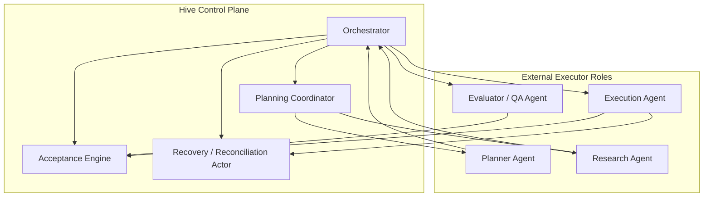

# 15 Agent Role Topology and Run Contract

## Purpose

- 定义 Hive vNext 的多 agent 角色拓扑。
- 明确哪些职责属于控制平面角色，哪些职责由外部执行器角色承担。
- 给出标准 `Run Contract` 模板，保证不同类型 worker 都在统一约束下运行。

## Scope

- 本文覆盖 Planner、Research、Execution、Evaluator、Recovery 角色分工与 run contract 结构。
- 本文不改变当前 MVP 的 command model、change-set / outbox 语义和 adapter 边界。
- 当前 command / handler 落点仍以 `11-Control-Plane-API-Contract.md` 与 `14-Command-Handler-Blueprint.md` 为准。

## Definitions

- `Control-Plane Role`：负责状态推进、调度、验收、恢复、checkpoint、replan 的 Hive 内部职责。
- `External Executor Role`：通过 adapter 被派发执行具体工作单元的外部角色实例。
- `Planner Agent`：把 directive、evidence、existing plan 编译成 spec、execution package、task graph 的外部规划角色。
- `Research Agent`：围绕研究问题收集、比较、归纳 evidence 的外部调研角色。
- `Execution Agent`：执行实现、修改、验证、产出 artifacts 的外部执行角色。
- `Evaluator / QA Agent`：独立于 execution 的外部验证角色。
- `Recovery / Reconciliation Actor`：处理 timeout、ambiguity、partial handoff、supersession、reset gate 的控制平面职责，必要时可请求外部 worker 辅助收集证据。
- `Run Contract`：单个外部角色执行一次 bounded work unit 的标准化派发契约。

## Rules

### 角色拓扑总规则

1. Hive 自己不做通用 agent。
2. Orchestrator 只负责编排与状态推进，不承担外部角色的具体工作。
3. Planner、Research、Execution、Evaluator 可以共享底层执行器能力，但在协议上必须视为不同角色。
4. Evaluator 必须独立于同一工作单元的 Execution Agent。
5. Recovery / Reconciliation 的最终状态决策属于控制平面，不属于 adapter，也不属于外部 worker。
6. 外部 worker 不从共享队列自主 claim task；`Run Contract` 只能由 control plane 编译并派发。

### 角色分工矩阵

| 角色族 | 角色 | 所属 | 主要职责 | 主要输出 | 禁止事项 |
|---|---|---|---|---|---|
| 控制平面 | `Orchestrator` | Hive | intake、调度、优先级、preemption、replan、checkpoint、reset gate | commands、dispatch intents、recovery decisions | 不读源码，不执行任务 |
| 控制平面 | `Planning Coordinator` | Hive | 决定是否 research、是否补 spec、如何编译任务图 | planning requests、compile commands | 不直接写完成结论 |
| 控制平面 | `Acceptance Engine` | Hive | 独立验收、更新 ledger、决定 followup | `Acceptance`、followup task、issue | 不直接执行任务 |
| 控制平面 | `Recovery / Reconciliation Actor` | Hive | timeout、ambiguity、partial handoff、supersession、reset recovery | `RecoveryAction`、requeue / block / reset decisions | 不绕过 authoritative state |
| 外部执行器 | `Planner Agent` | external executor | 将 directive / evidence 扩展成 spec、execution package、task graph 草案 | spec draft、plan draft、task candidates | 不直接派发自己产出的任务 |
| 外部执行器 | `Research Agent` | external executor | 收集证据、比较方案、整理 claims 与风险 | evidence fragments、source refs、open questions | 不直接把结论写成 runtime truth |
| 外部执行器 | `Execution Agent` | external executor | 实施 bounded change、运行验证、提交 handoff | code/doc artifacts、validation outputs、handoff | 不宣布最终完成 |
| 外部执行器 | `Evaluator / QA Agent` | external executor | 独立执行验证、审查 handoff、补充质量证据 | validation report、defect list、evidence refs | 不替代 acceptance engine 写最终状态 |

### Planner / Research / Execution / Evaluator / Recovery 责任边界

#### Planner Agent

- 输入：directive、evidence refs、existing charter / plan summary
- 产出：product spec draft、execution plan draft、task graph draft、run contract draft
- 约束：不能直接启动 run；其输出必须经过控制平面编译 / 接纳

#### Research Agent

- 输入：research question、source budget、allowed sources
- 产出：evidence refs、claims、options、risks、open questions
- 约束：不能直接生成 ready task

#### Execution Agent

- 输入：run contract、workspace、evidence refs、constraints
- 产出：artifacts、logs、validation outputs、handoff
- 约束：必须按小步推进；不能自判 done

#### Evaluator / QA Agent

- 输入：run contract、handoff、artifacts、validation method、acceptance hooks
- 产出：独立验证证据、缺陷清单、复验结果
- 约束：必须与执行 worker 隔离

#### Recovery / Reconciliation Actor

- 输入：active runs、timeouts、partial handoff、open issues、user interrupt、latest checkpoint
- 产出：pause / cancel / supersede / replan / reset decisions
- 约束：即使使用外部 worker 协助收集证据，最终状态决策仍在控制平面

### Run Contract 总规则

- 每个 run contract 只绑定一个角色、一个主要 objective、一个 bounded scope。
- worker 只能消费已派发给自己的 `Run Contract`，不得自己 claim 未派发任务。
- run contract 必须能被下一轮 session 读取与接力。
- run contract 必须显式写出 done criteria、validation method、escalation rule。
- run contract 必须显式写出 timeout / heartbeat expectation。
- run contract 必须显式写出 handoff requirements。

### Standard Run Contract Template

```yaml
run_contract:
  run_contract_id: rc_20260411_01
  role: execution_agent
  objective: 在限定路径内完成登录页表单验证修复
  inputs:
    directive_refs:
      - dir_20260411_01
    task_refs:
      - task_ui_login_03
    spec_refs:
      - spec_auth_v2
  evidence_to_read:
    - evidence_pack: ep_auth_02
    - previous_handoff: handoff_run_11
    - acceptance_note: acceptance_auth_04
  file_path_scope:
    allowed_paths:
      - apps/web/src/routes/login.tsx
      - apps/web/src/components/auth/*
    forbidden_paths:
      - packages/server/*
      - migrations/*
  constraints:
    - 不修改认证协议边界
    - 不引入新依赖
    - 必须保留现有测试风格
  done_criteria:
    - 登录表单校验逻辑符合 spec
    - 相关测试通过
    - handoff 记录修改文件与风险
  validation_method:
    - pnpm test --filter login-form
    - manual_smoke: login happy path + invalid input path
  escalation_rule:
    - 遇到 spec 冲突或超出路径范围时立即升级
    - 遇到缺失输入时提交 blocker handoff，不自行扩范围
  timeout_heartbeat_expectation:
    start_sla_minutes: 5
    heartbeat_minutes: 10
    hard_timeout_minutes: 60
  handoff_requirements:
    - modified_files
    - validation_results
    - assumptions
    - risks
    - next_steps
    - partial_progress_if_incomplete
```

### Incremental Progress Discipline

- 任何角色都不得在一个 run contract 中承担“完整项目”。
- Planner 应拆成 spec 补全、task graph 编译、run contract 生成等小步。
- Research 应按 research question 拆成独立 sprint。
- Execution 应按 bounded scope 和明确验证方法拆分。
- Evaluator 应按 acceptance slice 或 defect cluster 拆分。

## Protocol Steps

1. 控制平面确定需要哪类角色来推进当前状态。
2. 编译角色专属 `Run Contract`。
3. Scheduler 基于依赖、优先级、锁和用户 steering input 选择 ready contract。
4. Adapter 启动对应外部角色实例。
5. 角色实例产出 handoff / artifacts / validation outputs。
6. Acceptance Engine 和 Recovery / Reconciliation Actor 决定是否 accepted、followup、replan、reset。

## Mermaid

### 角色拓扑图



## Anti-patterns

- 用同一个 agent 同时做 execution 和 final evaluation。
- Planner 直接把自己生成的 task 标成 ready 并自派发。
- worker 自己从 backlog claim task，绕过 control plane dispatch。
- Research Agent 一边调研一边直接改 runtime truth。
- Recovery 决策依赖 adapter 或 worker 自报状态，而不是 authoritative object state。
- run contract 缺少 done criteria、validation 或 handoff requirements。

## Acceptance Criteria

- 读者能明确区分控制平面角色与外部执行器角色。
- 读者能明确知道 Planner、Research、Execution、Evaluator、Recovery 的职责边界。
- 读者能直接复用本文的 `Run Contract` 模板编写标准化派发包。
