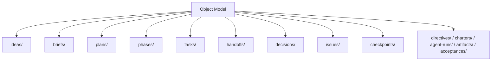

# 01 文件系统协同规则

## Purpose

- 用文件系统承载外部状态，而不是承载隐式约定。
- 保证对象可定位、状态可审计、恢复可重建。

## Rules

### Coordination Discipline

- Directory must represent object model.
- 一个目录只承载一种对象语义。
- 文件系统布局必须稳定，不依赖临时命名习惯。

示例目录：

- `ideas/`
- `briefs/`
- `plans/`
- `phases/`
- `tasks/`
- `handoffs/`
- `decisions/`
- `issues/`
- `checkpoints/`

当前对象模型扩展目录：

- `directives/`
- `charters/`
- `agent-runs/`
- `artifacts/`
- `acceptances/`

### Single Source of Truth Rule

- Task state only exists in task object.
- AgentRun state only exists in agent-run object.
- Checkpoint 只做恢复摘要，不复制原对象状态。

### No Implicit State Inference

- No implicit state inference.
- 禁止从文件名、目录名、分支名推断状态。
- 禁止用“目录里有产物”推断 Task 已完成。

### Explicit State Update Rule

- 所有状态变更必须显式写字段。
- 所有归档动作必须显式标记或迁移。

### Archive Rule

- 已完成对象应定期归档。
- 归档后仍必须保留可追溯 ID、状态、时间和引用关系。

## Protocol Steps

1. 识别对象类型。
2. 写入对应目录。
3. 在对象字段中写入状态。
4. 用显式引用关联其他对象。
5. 更新状态时只修改对象本身，不做隐式双写。

## Mermaid Diagram

### Filesystem Coordination Map

## Anti-patterns

- 在同一目录混放 Task、Issue、Handoff。
- 用 `done-xxx.md` 或 `failed-xxx.md` 表示状态。
- 在 Checkpoint 中复制 Task 全量状态并继续双写。
- 仅凭产物文件存在就推进 Phase。

## Acceptance Criteria

- 任一对象都能通过目录语义快速定位。
- 任一状态都必须从对象字段读取，而不是从命名猜测。
- 任一恢复流程都能只依赖对象目录与显式字段完成。
