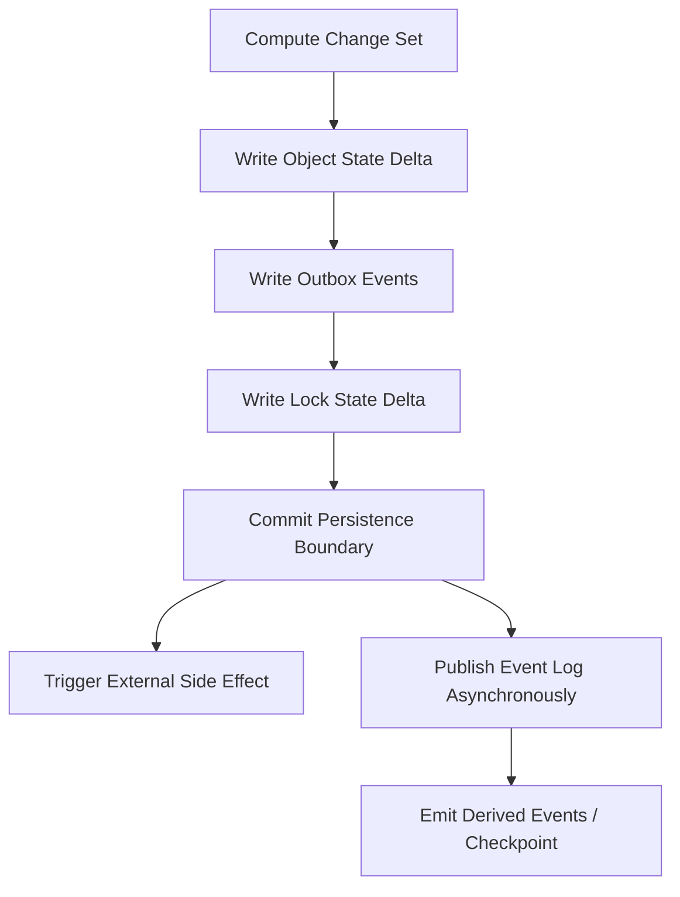
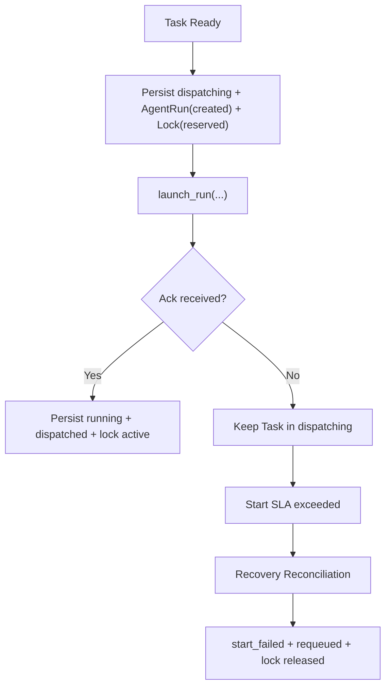

# 02 Consistency and Transaction Boundaries

## Purpose

- 定义 Event Log、Object State、Checkpoint 三者的一致性边界。
- 约束派发、加锁、创建 AgentRun、写事件、恢复重放的推荐顺序。
- 避免 blind dual-write、重复派发、错误 replay。

## Scope

- 本文描述控制平面的推荐一致性策略。
- 本文不绑定某个具体数据库，但要求实现方能提供等价语义。

## Definitions

- `Authoritative Object State`：当前事实，以对象状态为准。
- `Event Log`：不可变事实历史与审计链。
- `Checkpoint`：由当前状态与事件位置派生的恢复快照。
- `Change Set`：一次逻辑状态变更的最小持久化单元。
- `Outbox Event`：与对象状态在同一持久化边界内落盘、随后异步发布到 Event Log 的事件。
- `External Side Effect`：launch run、kill run、发送通知、创建 PR 等控制面外动作。

## Rules

### Truth Hierarchy

1. `Object State` 是当前事实来源。
2. `Event Log` 是事实历史与重放输入，不直接等价于当前状态。
3. `Checkpoint` 是恢复快照，不可反向覆盖对象事实。

### Recommended Consistency Strategy

- 推荐 `authoritative state + outbox event + derived checkpoint`。
- 推荐单写者控制面：同一对象状态变更由 Orchestrator change-set 统一提交。
- 推荐在同一持久化边界内同时写：
  - object state delta
  - outbox events
  - lock state delta
- 外部副作用必须在 change-set durable 之后触发。
- 若当前实现仅有文件系统，应以“journaled change-set + append-only event files + deterministic apply order”近似该边界。

### Event-first / State-first / Dual-write

- `Event-first`：不推荐用于会触发外部副作用的状态变更。
- `State-first without outbox`：仅作为降级方案；需要 recovery reconciliation 补发事件。
- `Blind dual-write`：禁止。不得分别“顺手写 state 再顺手写 event”而无补偿。

### Derived Event Rule

- derived event 必须基于已提交的 object state 生成。
- 未持久化的推测结果不得先发 derived event。
- derived event 失败发布时，不得回滚已提交事实；必须留待补发或恢复。

### Replay Boundary

- replay 用于：
  - 重建读模型
  - 补发丢失的 derived event
  - 辅助 recovery reconciliation
- replay 不得直接重放外部副作用。
- `launch_run(...)`、`kill_run(...)`、通知、PR 创建等外部动作必须通过 reconciliation 决定是否补执行。

### Dedup and Duplicate Dispatch Prevention

- 所有 dispatch 相关事件必须带稳定 `idempotency_key`。
- Task 在 dispatch 流程中必须进入 `dispatching`，防止重复派发。
- `AgentRun(created)` 未确认启动成功前，不得再创建第二个活跃 run，除非 recovery 明确接管。

## Recommended Order

### 推荐顺序：Directive 应用

1. 写 `Directive`
2. 写 impact analysis 结果
3. 写 Plan Revision / Task state delta
4. 写 outbox events
5. 提交 change-set
6. 异步发布 Event Log
7. 触发后续 planning / scheduling

### 推荐顺序：Task 派发

1. Scheduler 选出 ready task
2. Lock Manager 计算并预留锁集合
3. 在同一 change-set 中提交：
   - `Task.ready -> dispatching`
   - `AgentRun.created`
   - `Lock.requested -> reserved`
   - `DispatchPrepared` / `LockAcquired` outbox events
4. change-set durable 后调用 `launch_run(...)`
5. 若启动成功，再提交：
   - `AgentRun.created -> running`
   - `Task.dispatching -> dispatched`
   - `Lock.reserved -> active`
   - `TaskDispatched` / `AgentRunStarted` outbox events
6. 若启动失败或启动确认丢失，进入 recovery path

### 推荐顺序：Handoff 验收

1. 写 `Handoff.submitted`
2. 收集 artifacts / logs / validation
3. Acceptance Engine 生成 `Acceptance`
4. 在同一 change-set 中提交：
   - Acceptance result
   - Task next state
   - Issue / followup action if needed
   - outbox events
5. Checkpoint Writer 异步写 checkpoint

## Failure Scenario

### 场景：Dispatch change-set 已提交，但 `launch_run(...)` 无确认

#### Before

- `Task.status = ready`
- 无 active run
- 无 active lock

#### Steps

1. Scheduler 选中 Task。
2. change-set 提交成功：
   - `Task.status = dispatching`
   - `AgentRun.status = created`
   - `Lock.status = reserved`
   - `DispatchPrepared` 写入 outbox
3. `launch_run(...)` 调用超时，未收到成功或失败确认。
4. Orchestrator 不得立即重派同一 Task。
5. `Lease / Heartbeat Monitor` 检查发现 `AgentRun.created` 超过 start SLA。
6. `Recovery Coordinator` 执行 reconciliation：
   - 轮询 adapter 是否存在真实运行实例
   - 若不存在，提交 change-set：
     - `AgentRun.created -> start_failed`
     - `Task.dispatching -> requeued`
     - `Lock.reserved -> recovery_hold -> released`
     - 写 `AgentRunStartFailed`、`TaskRequeued`、`LockReleased`
7. Scheduler 才允许再次派发。

#### After

- 无重复活跃 run
- 无悬空 reserved lock
- Task 可安全重新进入调度流

## Mermaid Diagram

### Recommended Write Ordering

### Dispatch Failure Boundary

## Anti-patterns

- 先 `launch_run(...)`，后补写 Task / AgentRun / Lock 状态。
- 先发事件，再看是否能把状态写成功。
- Object State 与 Event Log 分开 best-effort 双写。
- replay 时再次执行 `launch_run(...)`。
- 用 Checkpoint 回填 object state。

## Acceptance Criteria

- 读者能明确知道谁是当前事实源、谁是历史、谁是恢复快照。
- 读者能明确知道 dispatch、acceptance、checkpoint 的推荐写顺序。
- 读者能明确知道系统如何避免重复派发与 blind dual-write。
- 失败场景能落到具体对象状态与补偿步骤。
