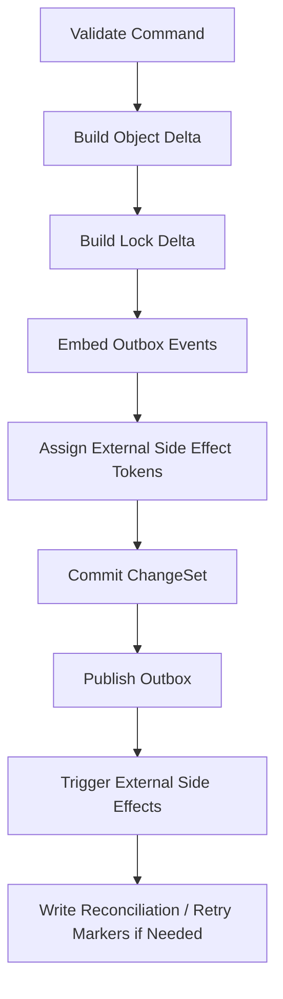

# 03 Change-Set and Outbox Contract

## Purpose

- 将一致性原则收敛为可实现的持久化协议。
- 定义 change-set、object delta、lock delta、outbox event、补偿标记和外部副作用 token。
- 让实现方能够直接设计事务层或 journal 层。

## Scope

- 本文定义逻辑 contract，不绑定数据库实现。
- canonical 字段和 enum 以 `../03-state-model/06-Canonical-Enums-and-Identifiers.md` 为准。
- ChangeSet、Event 与对象字段的 canonical schema 以 `../08-appendix/11-Schema-Catalog.md` 为准。
- MVP 的具体 backend 落地建议见 `./04-MVP-Storage-Backend-Profile.md`。

## Definitions

- `ChangeSet`：一次原子性逻辑变更的结构化包。
- `Object Delta`：某个对象在本次变更中的字段变化。
- `Lock Delta`：锁对象在本次变更中的字段变化。
- `Outbox Event`：与 change-set 同边界持久化，后续异步发布到 Event Log 的事件。
- `External Side Effect Token`：标识已触发或将触发的外部动作。
- `Reconciliation Marker`：用于恢复重放与对账的标记。
- `Compensation Marker`：用于后续补偿或回滚路径的标记。

## Rules

### ChangeSet Minimum Structure

```yaml
changeset_id: cs_20260410_0001
command_name: prepare_dispatch
command_id: cmd_20260410_020
idempotency_key: dispatch:task_auth_backend_07:plan_rev_12
issued_at: 2026-04-10T12:00:00Z
actor_ref: orchestrator/main
correlation_id: corr_auth_dispatch_07
object_deltas: []
lock_deltas: []
outbox_events: []
external_side_effects: []
reconciliation_markers: []
retry_markers: []
compensation_markers: []
commit_result:
  status: committed
  committed_at: 2026-04-10T12:00:01Z
```

### Apply Order

推荐 apply order：

1. validate preconditions
2. compute object delta
3. compute lock delta
4. embed outbox events
5. assign external side effect token placeholders
6. commit change-set
7. publish outbox events
8. trigger external side effects
9. write reconciliation markers if needed

### Delta Rules

- object delta 必须显式表达 `before` 与 `after`。
- lock delta 必须显式表达 owner 与 status 变化。
- outbox event 必须带 `event_id` 与 `idempotency_key`。
- external side effect token 必须可追溯到 command 与 object。
- compensation marker 必须说明触发条件与补偿命令。

### Failure Compensation Rules

- commit 前失败：不得触发外部副作用。
- commit 成功但 outbox 发布失败：保留 change-set，走补发路径。
- commit 成功但 external side effect 超时：写 reconciliation marker，不得直接重派。
- compensation 不等于回滚 authoritative history；默认使用新 change-set 纠正状态。

## Object Delta Contract

```yaml
object_deltas:
  - object_type: Task
    object_id: task_auth_backend_07
    before:
      status: ready
    after:
      status: dispatching
  - object_type: AgentRun
    object_id: run_codex_003
    before: null
    after:
      status: created
      task_id: task_auth_backend_07
```

## Lock Delta Contract

```yaml
lock_deltas:
  - lock_id: lock_auth_write_07
    before:
      status: requested
    after:
      status: reserved
      owner_task_id: task_auth_backend_07
      owner_run_id: run_codex_003
```

## Outbox Event Contract

```yaml
outbox_events:
  - event_id: evt_20260410_020
    event_type: DispatchPrepared
    object_ref:
      object_type: Task
      object_id: task_auth_backend_07
    idempotency_key: dispatch:task_auth_backend_07:plan_rev_12
    payload:
      run_id: run_codex_003
```

## External Side Effect Token Contract

```yaml
external_side_effects:
  - token_id: sidefx_launch_run_codex_003
    side_effect_type: launch_run
    status: pending
    executor_name: codex
    object_refs:
      - run_codex_003
```

## Reconciliation / Retry / Compensation Markers

```yaml
reconciliation_markers:
  - marker_id: recon_run_codex_003_start
    reason: launch_ack_missing
retry_markers:
  - marker_id: retry_publish_evt_20260410_020
    target: outbox_publish
compensation_markers:
  - marker_id: compensate_dispatch_task_auth_backend_07
    trigger: no_live_run_after_start_sla
    action: start_recovery
```

## Example 1: Dispatch ChangeSet

```yaml
changeset_id: cs_20260410_0101
command_name: prepare_dispatch
command_id: cmd_20260410_021
idempotency_key: dispatch:task_auth_backend_07:plan_rev_12
actor_ref: orchestrator/main
object_deltas:
  - object_type: Task
    object_id: task_auth_backend_07
    before: {status: ready}
    after: {status: dispatching}
  - object_type: AgentRun
    object_id: run_codex_003
    before: null
    after:
      status: created
      task_id: task_auth_backend_07
      executor_name: codex
lock_deltas:
  - lock_id: lock_auth_write_07
    before: {status: requested}
    after:
      status: reserved
      owner_task_id: task_auth_backend_07
      owner_run_id: run_codex_003
outbox_events:
  - event_id: evt_20260410_021
    event_type: DispatchPrepared
    object_ref: {object_type: Task, object_id: task_auth_backend_07}
    idempotency_key: dispatch:task_auth_backend_07:plan_rev_12
external_side_effects:
  - token_id: sidefx_launch_run_codex_003
    side_effect_type: launch_run
    status: pending
commit_result:
  status: committed
  committed_at: 2026-04-10T12:00:01Z
```

## Example 2: Acceptance ChangeSet

```yaml
changeset_id: cs_20260410_0201
command_name: run_acceptance
command_id: cmd_20260410_031
idempotency_key: acceptance:handoff_20260410_03:policy_default
actor_ref: acceptance-engine/main
object_deltas:
  - object_type: Acceptance
    object_id: acceptance_20260410_01
    before: null
    after:
      status: accepted
      task_id: task_auth_backend_07
      handoff_id: handoff_20260410_03
  - object_type: Task
    object_id: task_auth_backend_07
    before: {status: awaiting_acceptance}
    after: {status: accepted}
outbox_events:
  - event_id: evt_20260410_031
    event_type: AcceptancePassed
    object_ref: {object_type: Task, object_id: task_auth_backend_07}
    idempotency_key: acceptance:handoff_20260410_03:policy_default
commit_result:
  status: committed
  committed_at: 2026-04-10T12:15:01Z
```

## Failure Scenario

### Dispatch commit 成功，outbox 发布失败

1. change-set 已 durable。
2. authoritative state 已更新为 `dispatching / created / reserved`。
3. outbox publisher 故障，`DispatchPrepared` 未发布。
4. recovery job 依据 `retry_marker` 重发 event。
5. 不得重新提交第二个 dispatch change-set。

## Mermaid Diagram

### ChangeSet Apply Order



## Anti-patterns

- change-set 只有对象 after，没有 before。
- outbox event 在 commit 之后临时拼接。
- side effect token 不可追溯，导致恢复时无法判断是否已触发。
- 失败后直接修改对象状态，不留下补偿标记。

## Acceptance Criteria

- 实现方可据此设计 transaction layer、journal layer 或文件系统变更包。
- dispatch 与 acceptance 至少都有完整 change-set 示例。
- 读者能明确知道 apply order、失败补偿和 retry marker 的用途。
