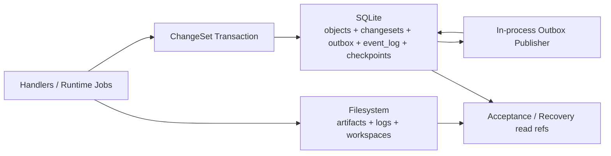

# 04 MVP Storage Backend Profile

## Purpose

- 为首个 Hive 控制平面原型收敛明确的存储后端建议。
- 把 v0.4 的一致性原则落成首版可实现的 backend profile。
- 明确哪些对象进数据库、哪些产物进文件系统，以及为什么首版不先上更重的基础设施。

## Scope

- 本文只定义 MVP 的推荐实现。
- 本文不否认后续升级到 Postgres、object storage、queue 的可能性。
- authoritative state、event log、checkpoint、change-set / outbox 的语义仍以既有章节为准。

## Definitions

- `State DB`：承载 authoritative object state、change-set、event log、outbox 的主数据库。
- `Artifact FS`：承载 artifacts、logs、workspace snapshot 的文件系统根目录。
- `Local Object Ref`：指向 Artifact FS 中文件或目录的稳定引用。

## Recommended MVP Choice

首版推荐：

- `SQLite` 作为唯一结构化状态数据库
- 本地文件系统作为 artifact / log / workspace 存储
- 不要求 object storage、Postgres、MQ、分布式事件总线

推荐组合：

- `SQLite (WAL mode)` + `filesystem`

不推荐首版并行实现：

- `Postgres + object storage + queue`
- `SQLite + 额外 MQ`
- 事件总线先行、状态库后补

原因：

- MVP 已明确为单仓库、单 active plan、单 writer。
- change-set、outbox、event log 最需要的是本地强一致边界，而不是跨节点吞吐。
- 首版核心风险在控制平面闭环，而不在数据库扩展性。

## Backend Placement

| 存储层 | MVP 后端 | 存放内容 | 不存放内容 |
|---|---|---|---|
| `State DB` | SQLite | `Directive`、`PlanRevision`、`Phase`、`Task`、`AgentRun`、`Handoff`、`Acceptance`、`Issue`、`Lock`、`Checkpoint`、`DispatchIntent`、`RecoveryAction`、`ChangeSet`、`OutboxEvent`、`EventLog`、migration state、idempotency records | 大体积原始终端日志、workspace 临时文件 |
| `Artifact FS` | filesystem | patches、reports、screenshots、test outputs、handoff attachments、normalized log files、workspace archives | authoritative object state、lock truth、task status |

## SQLite Storage Profile

### 首版应有的结构化表

首版建议至少建立以下表或等价集合：

- `directives`
- `plan_revisions`
- `phases`
- `tasks`
- `agent_runs`
- `handoffs`
- `acceptances`
- `issues`
- `locks`
- `checkpoints`
- `dispatch_intents`
- `recovery_actions`
- `changesets`
- `outbox_events`
- `event_log`
- `idempotency_keys`
- `schema_migrations`

### 表设计原则

- 每个对象保留 canonical ID 与 canonical status 字段。
- 需要审计的对象保留 `created_at`、`updated_at`、`correlation_id`。
- `changesets`、`outbox_events`、`event_log` 必须 append-first，不允许就地篡改历史字段。
- 可以使用结构化列加 `json payload` 的混合方式，但 authoritative 状态查询所需字段必须可索引。

## Filesystem Storage Profile

### 推荐目录

```text
var/
├── state/
│   └── hive.db
├── artifacts/
│   └── <run_id>/
├── logs/
│   └── <run_id>/
├── workspaces/
│   └── <run_id>/
└── exports/
    └── checkpoints/
```

### 文件系统只承载这些内容

- adapter 采集的原始终端日志
- patch、diff、test output、截图等 artifact 文件
- handoff 附件
- run workspace 或 workspace archive
- 可选的 checkpoint 导出文件

### 文件系统不承载这些事实

- `Task.status`
- `AgentRun.status`
- `Lock.status`
- `Acceptance.status`
- `current active plan_revision`

这些状态必须在 SQLite 中读取。

## Minimal Event Log Implementation

首版 event log 推荐最小实现为 SQLite append-only 表：

- 表名：`event_log`
- 必需字段：
  - `event_seq`：单调递增主键
  - `event_id`
  - `event_type`
  - `object_type`
  - `object_id`
  - `occurred_at`
  - `idempotency_key`
  - `payload_json`
  - `correlation_id`

实现要求：

- `event_seq` 作为 replay cursor。
- `event_id` 全局唯一。
- 至少对 `event_type + idempotency_key` 建唯一约束或等价 dedup 机制。
- 只允许 append，不允许 update event payload 改写历史。

## Minimal Outbox Implementation

首版 outbox 推荐为 SQLite 内同库表：

- 表名：`outbox_events`
- 必需字段：
  - `outbox_id`
  - `changeset_id`
  - `event_id`
  - `event_type`
  - `payload_json`
  - `publish_state`
  - `published_at`
  - `retry_count`

推荐状态：

- `pending`
- `published`
- `failed`

推荐流程：

1. handler 在同一 SQLite transaction 中提交：
   - object state delta
   - lock delta
   - `changesets`
   - `outbox_events(pending)`
2. transaction 提交成功后，由 in-process outbox publisher 读取 `pending` 行。
3. publisher append 到 `event_log`。
4. append 成功后将该 outbox 行更新为 `published`。
5. append 失败则增加 `retry_count`，由 recovery / publisher 重试。

## Minimal Checkpoint Implementation

首版 checkpoint 推荐：

- canonical `Checkpoint` 对象存 SQLite
- 可选导出 JSON 到 `var/exports/checkpoints/`

这样做的原因：

- checkpoint 本质是派生快照，需要与 `plan_revision_id`、`event_log_cursor`、open object summary 一起原子写入结构化存储。
- 运维可读性可以通过导出文件解决，但导出文件不是事实源。

首版 checkpoint 最小字段：

- `checkpoint_id`
- `status`
- `created_at`
- `plan_revision_id`
- `event_log_cursor`
- `active_phase_id`
- `active_directive_ids`
- `open_task_ids`
- `active_run_ids`
- `active_lock_ids`
- `open_issue_ids`

## Minimal Schema Migration Strategy

首版推荐：

- 使用顺序编号或时间戳 SQL migration 文件
- 只做 forward-only migration
- 用 `schema_migrations` 记录已应用版本

推荐目录：

- `migrations/sqlite/0001_init.sql`
- `migrations/sqlite/0002_changesets.sql`
- `migrations/sqlite/0003_acceptance.sql`

规则：

- migration 必须与 schema catalog 版本同步更新。
- 不做自动 down migration。
- 破坏性结构调整必须通过新 migration + backfill 完成，不得手工改库。

## Why MVP Does Not Start with Postgres / MQ / Distributed Bus

### 不先上 Postgres

- 单 writer MVP 下，Postgres 不解决当前最关键的语义风险。
- SQLite 更容易本地复现、调试、备份和时序回放。
- 首版重点是把 command/change-set/recovery 跑通，不是先解决网络化部署。

### 不先上 MQ

- outbox publisher 首版就在同一进程内，MQ 只会增加第二条 delivery consistency 面。
- 当前 eventing 目标是 audit + replay，不是大规模 fan-out。
- 没有先验证闭环前，引入 MQ 会掩盖到底是状态推进错，还是投递系统错。

### 不先上分布式事件总线

- 首版没有多 writer、跨节点订阅、跨仓 federated scheduling。
- 当前 replay 与 dedup 需求可以由 SQLite `event_log` 满足。
- 分布式总线是后续演进边界，不是 MVP 前提。

## Evolution Boundary

后续升级应保持不变的边界：

- `ChangeSet` 结构
- `OutboxEvent` 结构
- `EventLog` append-only 语义
- `Checkpoint` 作为派生快照的语义
- artifact / log 通过 stable ref 被对象引用

后续可替换的实现层：

- `SQLite -> Postgres`
- `filesystem artifacts -> object storage`
- `in-process outbox publisher -> queue-backed publisher`

升级时允许变化的内容：

- repository implementation
- connection management
- storage URI format
- publisher delivery mechanism

升级时不得变化的内容：

- 当前事实来源仍是 object state
- replay 仍不得直接重放外部 side effect
- checkpoint 仍不得反向覆盖 authoritative state

## Mermaid Diagram

### MVP Storage Profile



## Anti-patterns

- 把 authoritative state 分散到 SQLite、JSON 文件、日志三处并行双写。
- checkpoint 只写文件，不落结构化对象。
- outbox 不落盘，靠内存队列“顺手发一下”。
- 首版就把 SQLite、Postgres、MQ 三种路径并行维护。
- 用文件是否存在推断 acceptance 或 task completion。

## Acceptance Criteria

- 实现方能明确知道首版推荐的是 `SQLite + filesystem`。
- 实现方能明确知道每类对象应落在哪一层。
- 实现方能据此直接开始设计 migration、repository 和 artifact path。
- 首版为何不先上 Postgres / MQ / distributed bus 的理由已清楚记录。
