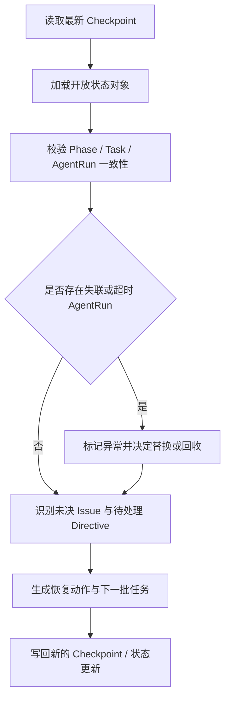

# 01 Checkpoint 与恢复机制

## Purpose

- 定义系统恢复所需的最小快照。
- 保证控制回合可结束、可重建、可继续。

## Rules

### Checkpoint Minimum Content

- 已完成任务
- 当前阶段状态
- 关键决策
- 已知问题
- 下一步动作
- 活跃 Directive 摘要
- 在途 Task / AgentRun 摘要

### Recovery Protocol

1. 读取最新 Checkpoint
2. 加载未完成 Directive、开放 Task、活跃或疑似失联的 AgentRun
3. 校验 Phase 与 Task 状态一致性
4. 识别未决 Issue
5. 生成下一批可执行任务或恢复动作

### Recovery Flow

### Context Reset Rule

- Orchestrator 可以周期性结束当前上下文并重新拉起控制回合。
- 新控制回合只依赖 Checkpoint、开放状态对象、最近的 Handoff / Acceptance 摘要。
- 禁止把长对话历史作为唯一恢复来源。

## Anti-patterns

- 不写 Checkpoint，靠对话历史恢复。
- Checkpoint 缺少活跃 Task 或 AgentRun 摘要。
- 恢复时忽略未决 Issue 或异常 AgentRun。
- 新控制回合继续依赖旧内存，不重新读取对象状态。

## Acceptance Criteria

- 任一控制回合结束后，都应能写出可恢复的 Checkpoint。
- 任一恢复动作都必须能仅依赖 Checkpoint 与开放对象重新启动。
- 任一失联 AgentRun 都必须在恢复时被发现并处理。
