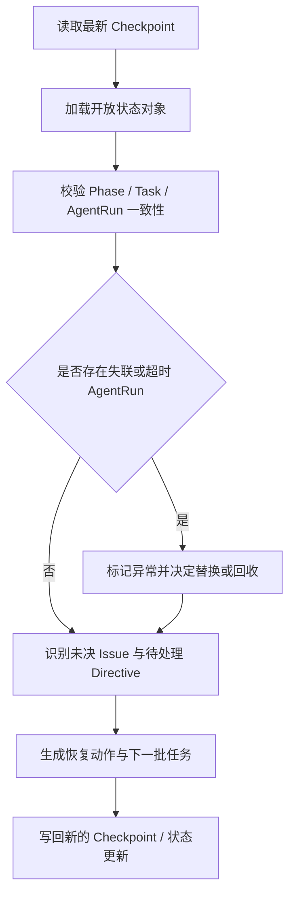

# 01 Checkpoint 与恢复机制

## Checkpoint 最小内容

- 已完成任务
- 当前阶段状态
- 关键决策
- 已知问题
- 下一步动作
- 活跃 Directive 摘要
- 在途 Task / AgentRun 摘要

## 恢复流程（建议）

1. 读取最新 Checkpoint
2. 加载未完成 Directive、开放 Task、活跃或疑似失联的 AgentRun
3. 校验 Phase 与 Task 状态一致性
4. 识别未决 Issue
5. 生成下一批可执行任务或恢复动作

## 恢复流程图

## 核心目标

系统恢复依赖状态对象，不依赖历史对话上下文。

## 控制器上下文清理

- Orchestrator 可以周期性结束当前上下文并重新拉起控制回合。
- 新控制回合只依赖 Checkpoint、开放状态对象、最近的 Handoff / Acceptance 摘要。
- 禁止把长对话历史作为唯一恢复来源。
