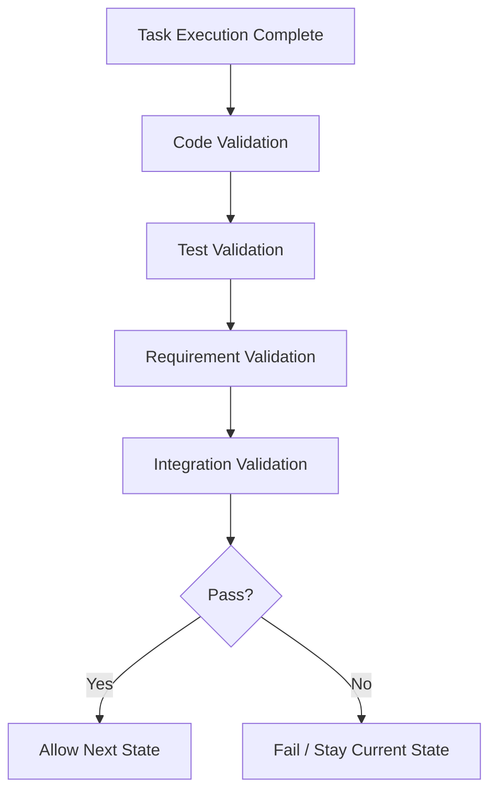

# 02 Evaluation Gates

## Purpose

- 定义 Hive 的评估闸门。
- 约束 Task 完成与 Phase 推进的验证条件。

## Rules

### Evaluation Discipline

- Task completion requires validation.
- 没有 validation 的完成声明无效。

### Validation Layers

- Code validation
- Test validation
- Requirement validation
- Integration validation

### Phase Gate Rule

Orchestrator 不得推进 Phase，除非同时满足：

- Task 完成
- Evaluation 通过
- 无 Blocker

### No Silent Progress Rule

- No silent progress.
- 任何进度都必须可验证。

## Protocol Steps

1. 确认 Task Execution Complete。
2. 执行 Code validation。
3. 执行 Test validation。
4. 执行 Requirement validation。
5. 执行 Integration validation。
6. 汇总结果为 Pass 或 Fail。
7. 只有 Pass 才允许进入下一状态。

## Mermaid Diagram

### Evaluation Gate

## Anti-patterns

- 仅凭 Handoff 总结推进 Task。
- 未做集成验证就宣称完成。
- 验证失败但不写状态或 Issue。

## Acceptance Criteria

- 每个完成的 Task 都必须附带 validation evidence。
- 每次 Phase 推进都必须能追溯到 evaluation pass。
