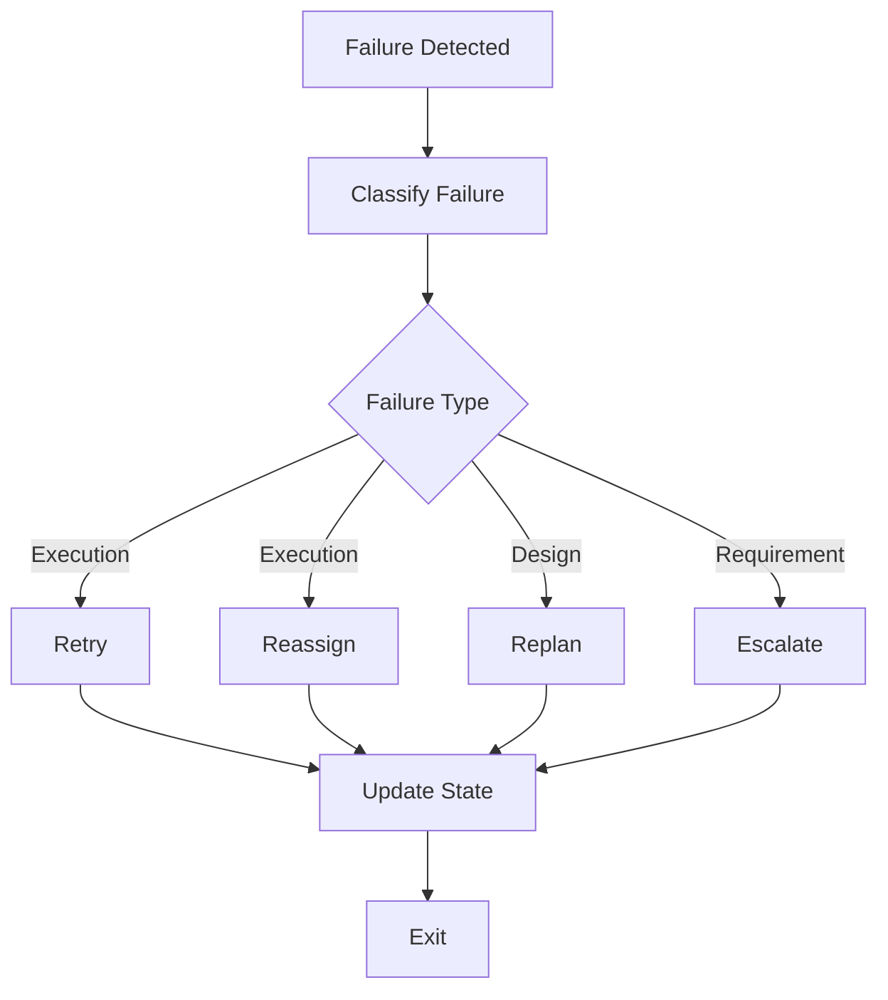

# 03 Failure Recovery Protocol

## Purpose

- 定义失败分类与恢复动作。
- 保证失败可见、可追溯、可恢复。
- 更细的 run 终止与重派矩阵见 `16-Run-Termination-and-Reassignment-Matrix.md`。

## Rules

### Failure Types

- Execution failure
- Design conflict
- Requirement conflict

### Worker Failure Protocol

Worker 必须：

- Classify failure
- Write issue record
- Preserve artifacts
- Suggest retry strategy

### Orchestrator Recovery Actions

Orchestrator 可执行：

- Retry
- Reassign
- Replan
- Escalate

规则：

- `Execution failure` 优先 `retry / reassign`
- `Design conflict` 优先 `replan` 或升级决策层
- `Requirement conflict` 必须升级到 `Steering / Escalation Authority` 或用户确认

### No Hidden Failures Rule

- No hidden failures.
- 所有失败都必须显式记录。

## Protocol Steps

1. 检测到 Failure。
2. Classify failure。
3. Write issue record。
4. Preserve artifacts。
5. 选择 Retry / Reassign / Replan / Escalate。
6. Update state。
7. Exit 当前失败上下文。

## Mermaid Diagram

### Failure Recovery Flow

## Anti-patterns

- 失败后直接重跑，不写 Issue。
- 丢弃日志和中间产物。
- 失败发生后继续静默推进。

## Acceptance Criteria

- 每次失败都必须有分类、记录、证据、恢复动作。
- 每次 Worker 异常都必须保留 artifacts 或日志引用。
