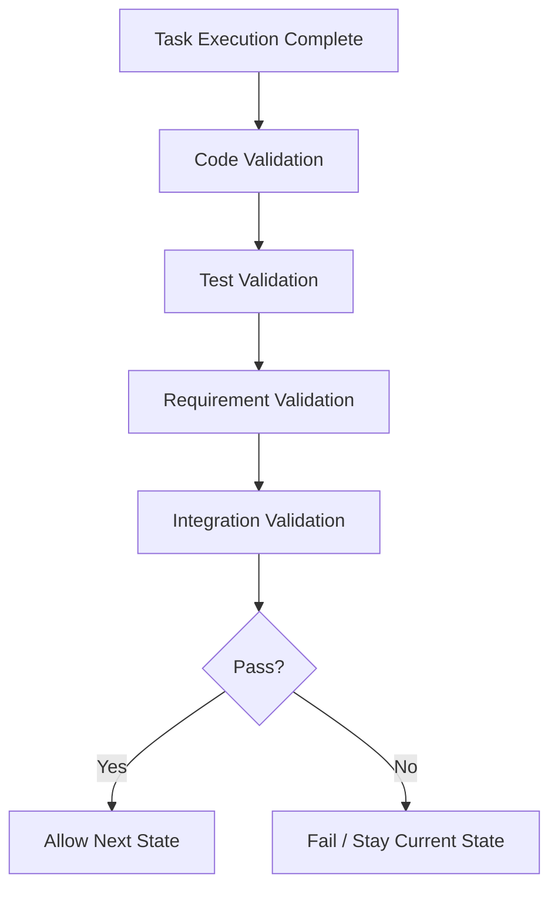

# 03 Evaluation Gates

## Purpose

- 定义 Hive 的验证闸门。
- 保证 Task completion 和 Phase progression 都依赖验证结果。

## Rules

### Terminology Note

- 本文中的 Drone 指运行控制职责。
- 在当前文档术语中，该职责由 Orchestrator 承担。

### Evaluation Rule

- Task completion requires validation.
- 未通过 validation 的 Task 不得进入 completed 语义。
- Drone 不得推进 Phase，除非同时满足 Task 完成、evaluation 通过、无 blocker。

### Validation Layers

- Code validation
- Test validation
- Requirement validation
- Integration validation

规则：

- Validation 类型由 Task spec 明确指定。
- 至少要覆盖 done criteria 和 output expectations。
- 无法执行的验证项必须显式记录原因与影响。

### Phase Gate Rule

- Task 完成
- Evaluation 通过
- 无 blocker

规则：

- 任一 gate 未通过时，Drone 不得推进 Phase。
- 失败的 validation 必须显式落状态或 Issue。

### Evidence Rule

- 每个 validation 必须有证据。
- 证据可以是日志、测试报告、构建结果、diff、artifact 引用。

### No Silent Progress Rule

- No silent progress.
- 任何进度必须可验证。
- 无验证证据的进度只能视为 in-progress 或 pending。

## Protocol Steps

1. 确认 Task Execution Complete。
2. 执行 Code Validation。
3. 执行 Test Validation。
4. 执行 Requirement Validation。
5. 执行 Integration Validation。
6. 汇总结果为 Pass 或 Fail。
7. 只有 Pass 才允许进入下一状态。

## Mermaid Diagram

### Evaluation Gate

## Anti-patterns

- 仅凭 Worker 总结就推进 Task。
- 未做集成验证就宣称整合完成。
- 验证失败但不写入状态或 Issue。
- 用“人工感觉没问题”代替证据。

## Acceptance Criteria

- 每个完成的 Task 都必须关联 validation evidence。
- 每次 Phase 推进都必须能回溯到 evaluation pass。
- 无证据的进度不得进入完成态。
