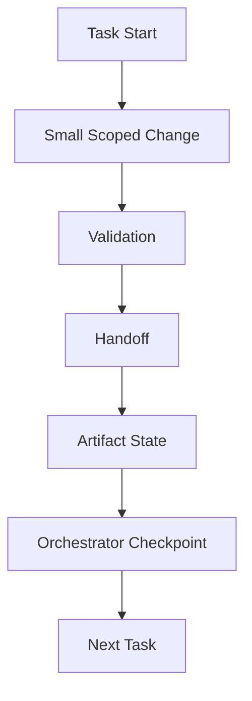

# 04 Incremental Progress Discipline

## Purpose

- 约束 Hive 的增量推进纪律。
- 保证每个 Task 的进度都可恢复、可交接、可验证。

## Rules

### Incremental Progress Rule

- Progress must be incremental.
- 禁止 large untracked changes。

### Required Outputs Per Task

每个 Task 必须生成：

- Handoff
- Artifact state
- Checkpoint input

规则：

- Worker 必须留下足够的进度摘要，使 Orchestrator 能写出 Checkpoint。
- 正式 `Checkpoint` 由 Orchestrator 汇总落盘。

## Protocol Steps

1. 启动 Task。
2. 执行 Small Scoped Change。
3. 完成 Validation。
4. 写入 Handoff。
5. 更新 Artifact state。
6. Orchestrator 汇总写入 Checkpoint。
7. 进入 Next Task。

## Mermaid Diagram

### Incremental Progress Cycle

## Anti-patterns

- 长时间积累大改动而不落盘。
- 只有最终结果，没有中间 Checkpoint 或 Handoff。

## Acceptance Criteria

- 每个 Task 都必须留下 Handoff、Artifact state 与 Checkpoint 输入。
- 大范围未跟踪变更不得进入后续流程。
