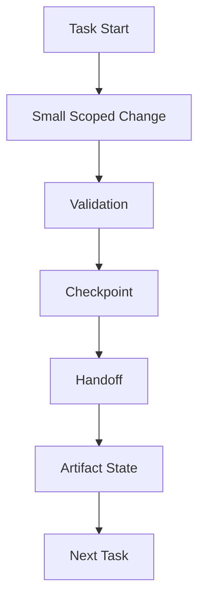

# 04 Incremental Progress Discipline

## Purpose

- 约束 Hive 的增量推进纪律。
- 保证每个 Task 的进度都可恢复、可交接、可验证。

## Rules

### Incremental Progress Rule

- Progress must be incremental.
- 禁止 large untracked changes。

### Required Outputs Per Task

Worker 必须为每个 Task 生成：

- Checkpoint
- Handoff
- Artifact state

## Protocol Steps

1. 启动 Task。
2. 执行 Small Scoped Change。
3. 完成 Validation。
4. 写入 Checkpoint。
5. 写入 Handoff。
6. 更新 Artifact state。
7. 进入 Next Task。

## Mermaid Diagram

### Incremental Progress Cycle

## Anti-patterns

- 长时间积累大改动而不落盘。
- 只有最终结果，没有中间 Checkpoint 或 Handoff。

## Acceptance Criteria

- 每个 Task 都必须留下 Checkpoint、Handoff、Artifact state。
- 大范围未跟踪变更不得进入后续流程。
