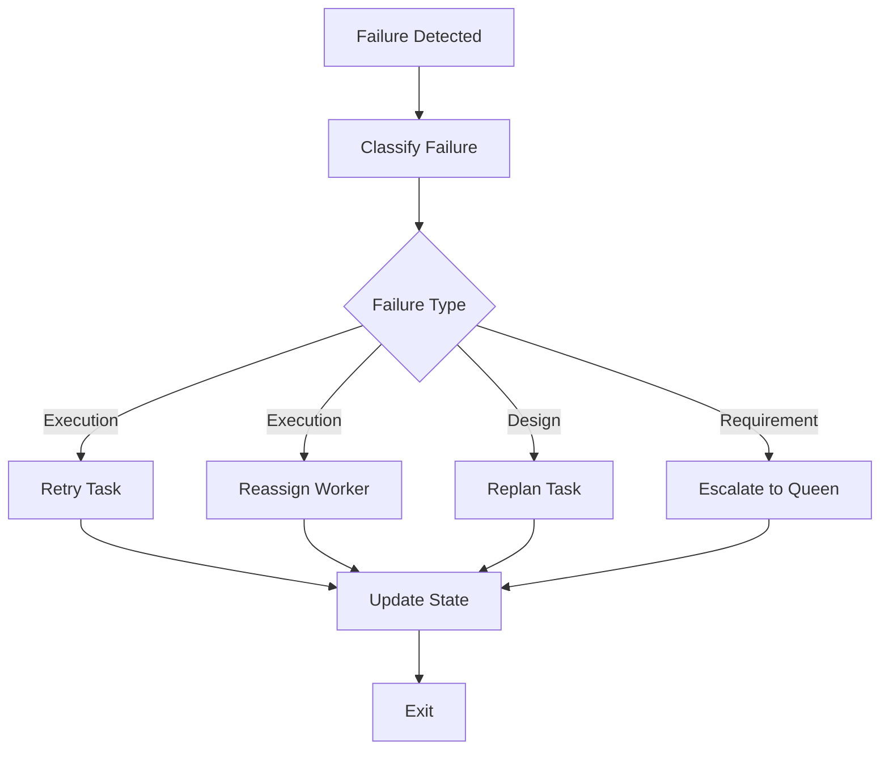

# 04 Failure Recovery Protocol

## Purpose

- 统一失败分类与恢复动作。
- 保证失败可见、可追溯、可恢复。

## Rules

### Terminology Note

- 本文中的 Drone 指运行控制职责。
- 在当前文档术语中，该职责由 Orchestrator 承担。

### Failure Types

- Execution failure
- Design conflict
- Requirement conflict

规则：

- 每个失败都必须归类。
- 分类不明时，默认先归为 Issue 并等待 Orchestrator 判定。

### Worker Failure Protocol

1. classify failure
2. write issue record
3. preserve artifacts
4. suggest retry

规则：

- Worker 失败时必须保留日志、产物、报错上下文。
- Worker 不得静默退出。
- Worker 不得覆盖已有失败证据。

### Drone Recovery Actions

- Retry task
- Reassign worker
- Replan task
- Escalate to Queen

规则：

- Execution failure 优先考虑 Retry task 或 Reassign worker。
- Design conflict 优先考虑 Replan task。
- Requirement conflict 必须 Escalate to Queen。

### Failure Visibility Rule

- No hidden failures.
- 任何超时、被杀、阻塞、验证失败都必须显式落状态。
- 恢复动作必须可追溯到 Issue、Task 或 AgentRun。

## Protocol Steps

1. 检测到 Failure。
2. Classify failure。
3. 写入 Issue record。
4. Preserve artifacts。
5. 选择 Retry task / Reassign worker / Replan task / Escalate to Queen。
6. Update state。
7. Exit 当前失败上下文。

## Mermaid Diagram

### Failure Recovery Flow

## Anti-patterns

- 失败后直接重跑，不记录 Issue。
- 丢弃报错日志和中间产物。
- 用人工口头解释代替正式失败分类。
- 失败已发生但 Phase 继续推进。

## Acceptance Criteria

- 每次失败都必须有分类、记录、证据、恢复动作。
- 每次 Worker 异常都必须保留 artifacts 或日志引用。
- 每次恢复都必须能说明为何 retry、reassign、replan 或 escalate。
