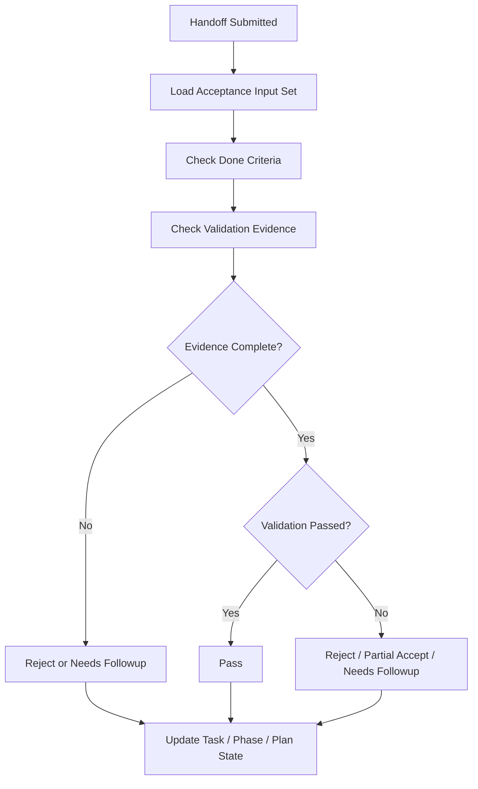

# 05 Acceptance Engine

## Purpose

- 将验收从原则提升为独立协议。
- 定义 Task 完成的输入、证据、结论与后续动作。
- 保证执行结束、Handoff 提交、Task 完成三者严格区分。

## Scope

- 本文覆盖 Task 级验收。
- Phase gate 仍由 `Evaluation Gates` 与本章结果共同约束。

## Definitions

- `Acceptance Input Set`：验收所需的最小输入集合。
- `Acceptance Evidence`：支撑验收结论的结构化证据。
- `Partial Accept`：接收部分产物，但不视为 Task 最终完成。
- `Needs Followup`：当前结果可保留，但必须创建后续任务或 recovery action。

## Rules

### Acceptance Input Set

- `Task`
- `AgentRun`
- `Handoff`
- `Artifact Refs`
- `Validation Results`
- `Relevant Plan References`
- `Open Issues`

### Validation Categories

- Code validation
- Test validation
- Requirement validation
- Integration validation

### Acceptance Outcomes

- `pass`
- `reject`
- `needs-followup`
- `partial-accept`

### Evidence Rule

- 没有证据的完成声明不得通过验收。
- 证据缺失时，默认 `reject` 或 `needs-followup`。
- partial handoff 只允许进入 `partial-accept` 或 `needs-followup`。

## Protocol Steps

1. 收集 `Acceptance Input Set`。
2. 核对 `done criteria` 与 `validation method`。
3. 检查证据完整性。
4. 归类验收结果为 `pass / reject / needs-followup / partial-accept`。
5. 回写 `Acceptance Record`。
6. 触发 `Task`、`Phase`、`Plan` 的后续状态变化。

## State / Schema

```yaml
acceptance_id: acc_20260410_01
task_id: task_auth_backend_07
handoff_id: handoff_20260410_03
input_set:
  artifacts:
    - artifact_logs_003
    - artifact_test_003
result: needs-followup
evidence_summary:
  code_validation: pass
  test_validation: fail
  requirement_validation: partial
  integration_validation: missing
reason: integration evidence missing
followup_actions:
  - create_task_auth_integration_09
```

## Mermaid Diagram

### Acceptance Decision Flow



## Anti-patterns

- Worker 自报完成就直接通过。
- 只看 summary，不看 evidence。
- partial handoff 直接记为 completed。
- 验收失败后不触发后续 recovery 或 task graph 更新。

## Acceptance Criteria

- 任一 Task 的完成都能找到 `Acceptance Record`。
- 任一验收结果都能回到证据集合。
- 任一 `partial-accept` 或 `needs-followup` 都会生成明确后续动作。
