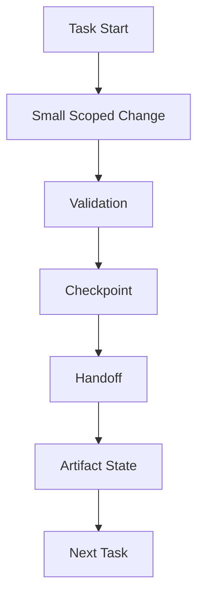

# 05 Incremental Progress Discipline

## Purpose

- 约束 Hive 的增量推进纪律。
- 保证每个 Task 都留下可恢复的进度痕迹。

## Rules

### Incremental Progress Rule

- Progress must be incremental.
- 每个 Task 只允许推进小范围、可验证的变化。
- 禁止 large untracked changes。

### Required Outputs Per Task

Worker 必须对每个 Task 生成：

- Checkpoint
- Handoff
- Artifact state

规则：

- 没有 Checkpoint 的进度不可恢复。
- 没有 Handoff 的进度不可交接。
- 没有 Artifact state 的进度不可验证。

### Tracking Rule

- 所有中间结果必须可追踪到 Task 和 AgentRun。
- 每次增量推进后必须写入状态更新或引用。

## Protocol Steps

1. 启动 Task。
2. 执行 Small Scoped Change。
3. 完成 Validation。
4. 写入 Checkpoint。
5. 写入 Handoff。
6. 更新 Artifact state。
7. 进入 Next Task。

## Mermaid Diagram

### Incremental Progress Cycle

## Anti-patterns

- 长时间不落盘的大改动。
- 一次 session 里累计大量未跟踪变更。
- 做了修改但不写 Checkpoint 或 Handoff。
- 只有最终结果，没有中间验证痕迹。

## Acceptance Criteria

- 每个 Task 都必须留下 Checkpoint、Handoff、Artifact state。
- 每次增量推进都必须能被验证和恢复。
- 大范围未跟踪变更不得进入后续流程。
