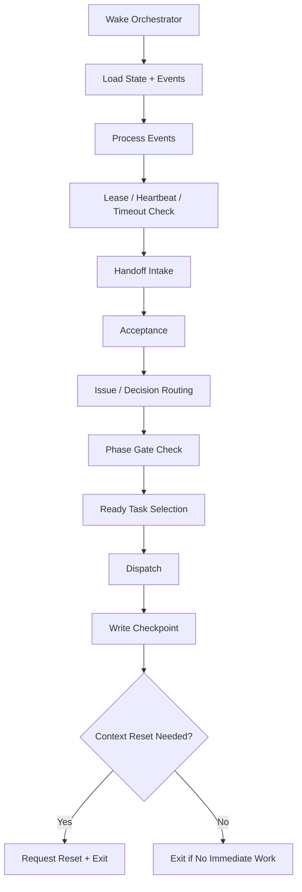
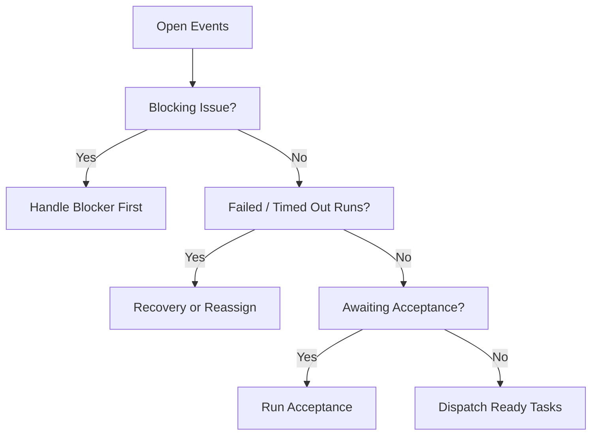

# 06 Orchestrator Reconcile Loop

## Purpose

- 定义 Hive 的主控制回路。
- 将 Orchestrator 明确为确定性调度器与事件驱动状态机。
- 回答项目如何持续运行、何时退出、何时恢复。

## Scope

- 本文只描述控制回路协议，不描述具体执行器内部行为。
- Orchestrator 不读源码、不执行 Task、不直接修改架构。
- 组件拆分见 `../00-overview/02-Reference-Architecture.md`。
- 一致性顺序见 `../06-coordination/02-Consistency-and-Transaction-Boundaries.md`。
- 首版 worker 进程模型见 `./12-Reconcile-Worker-and-Event-Processor-Blueprint.md`。

## Definitions

- `Control Cycle`：Orchestrator 被唤醒后处理一轮状态推进的循环。
- `Reconcile`：把事件流、对象状态、运行实例和计划版本对齐。
- `Ready Set`：当前满足派发条件的 Task 集合。
- `Recovery Trigger`：触发恢复或对账动作的条件。

## Rules

### Control Cycle Inputs

每轮 cycle 至少读取：

- 开放事件
- active `Directive`
- active `Execution Plan` 与 `plan_revision`
- active `Phase`
- ready / blocked / awaiting acceptance `Task`
- active / stale `AgentRun`
- open `Issue`
- pending `Decision`
- latest `Checkpoint`
- executor capacity 与锁状态

### Orchestrator Discipline

- Orchestrator 必须事件驱动唤醒。
- Orchestrator 必须短时运行并退出。
- Orchestrator 的连续性来自外部状态，不来自长 context。
- Orchestrator 不得跳过 guard checks 直接改状态。

### Reconcile Order

每轮 cycle 建议固定顺序：

1. load state
2. process events
3. lease / heartbeat check
4. timeout check
5. handoff intake
6. acceptance
7. issue routing
8. phase gate check
9. ready task selection
10. dispatch
11. checkpoint
12. context reset decision
13. exit

## Protocol Steps

1. 被事件、定时器或恢复策略唤醒。
2. 读取最新对象状态与 event queue。
3. 对开放事件做幂等处理。
4. 检查 active `AgentRun` 的 lease、heartbeat、timeout。
5. 接收新 `Handoff`，送入 Acceptance Engine。
6. 处理 `Issue`、`Decision`、`Runtime Directive`。
7. 检查 Phase gate，必要时推进或阻塞 Phase。
8. 计算 `Ready Set`，做锁检查与容量检查。
9. 派发下一批 Task，创建 `AgentRun`。
10. 写出 `Checkpoint`。
11. 若达到 context reset 策略，则请求 reset。
12. 当前轮无更高优先级事件待处理时退出。

## Mermaid Diagram

### Orchestrator Reconcile Loop

### Orchestrator Control Priorities

## Anti-patterns

- Orchestrator 变成长驻大 agent。
- 控制回路顺序每轮自由变化，导致行为不可预测。
- 不做 lease / timeout 检查就继续派发。
- handoff 不经 Acceptance 直接推进 Phase。
- context 爆炸后继续沿用旧对话而不 reset。

## Acceptance Criteria

- 读者能明确看到每轮 control cycle 的输入、顺序和退出条件。
- 任一 Task 派发前都能说明它经过了 ready、锁、容量、phase gate 检查。
- 任一恢复都能说明它由哪条 `Recovery Trigger` 触发。
