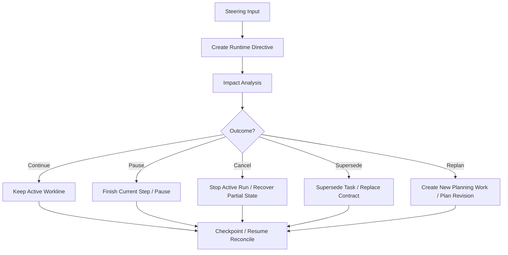

# 07 Runtime Directive Handling

## Purpose

- 定义运行中用户输入如何影响当前执行。
- 保证临时纠偏不会破坏对象状态一致性，也不会把 Hive 退回“大 agent 自由发挥”的模式。
- 把用户插话统一收敛为 `Directive -> impact analysis -> preemption / replan` 的治理流程。

## Scope

- 本文是运行中用户输入的总览协议。
- 详细的 preemption / supersession / replan / checkpoint 更新协议见 `15-User-Interrupt-Replan-and-Preemption-Protocol.md`。
- 首轮 bootstrap 入口见 `../04-planning/07-Project-Bootstrap-Protocol.md`。

## Definitions

- `Runtime Directive`：运行中新增输入形成的结构化 directive。
- `Steering Input`：用户对目标、范围、约束、优先级的新增输入。
- `Impact Analysis`：评估新增输入对 plan、task、active run、acceptance、checkpoint 的影响范围。
- `Preemption Decision`：对当前 active workline 执行 `continue / pause / cancel / supersede / replan` 的决策。

## Rules

### Directive Intake Rule

- 用户输入必须先进入 `UserInputReceived`。
- Orchestrator 必须把输入结构化为 `Directive`。
- `Directive` 未分析前，不得直接改 `Task` 状态。
- 用户输入优先级高于普通 ready task 调度。
- 用户输入不能直接改任务文件、run contract 或 handoff。

### Impact Analysis Dimensions

每次 runtime directive 至少评估以下维度：

- 目标是否改变
- 范围是否改变
- 约束是否改变
- 当前 active `PlanRevision` 是否失效
- 哪些 `Task` 需要继续、暂停、取消、supersede
- 哪些 `AgentRun` 可以 finish current step，哪些必须 stop
- 是否需要 partial handoff recovery
- 是否需要生成新的 revision / followup planning
- 是否需要立即写 checkpoint

### Impact Outcomes

- `continue`
- `pause`
- `cancel`
- `supersede`
- `replan`

### Active Run Handling Rule

- `continue`
  - 当前 run 保持不变，只记录 directive 与影响分析结果。
- `pause`
  - 优先选择 `finish_current_step`，写 checkpoint 与可恢复 handoff。
- `cancel`
  - 允许 `soft_stop` 或 `hard_kill`，但必须记录回收策略。
- `supersede`
  - 必须写替代关系、partial handoff 回收策略与后续 replacement task。
- `replan`
  - 必须生成新的 planning work item 或新 revision，不能只在聊天里口头改计划。

## Protocol Steps

1. 接收运行中的 `Steering Input`。
2. 创建 `Runtime Directive`。
3. 执行 impact analysis。
4. 判定 `continue / pause / cancel / supersede / replan`。
5. 更新 `Task`、`AgentRun`、`Issue`、`DispatchIntent` 的处置动作。
6. 视情况回收 partial handoff、生成 followup planning、更新 supersession mapping。
7. 写出 checkpoint 与必要的 marker。
8. 回到 Orchestrator reconcile loop。

## Mermaid

### 用户插话处理总览

## Anti-patterns

- 用户一句话直接修改 `Task` 文件。
- 运行中纠偏不做 impact analysis。
- supersede 旧任务但不处理活跃 `AgentRun`。
- 已取消工作线仍继续按原 contract 验收为完成。

## Acceptance Criteria

- 任一运行中用户输入都能回到 `Directive`。
- 任一 directive 都能找到 impact analysis 与处理结果。
- 读者能明确知道用户输入优先级高于普通 ready task 调度。
