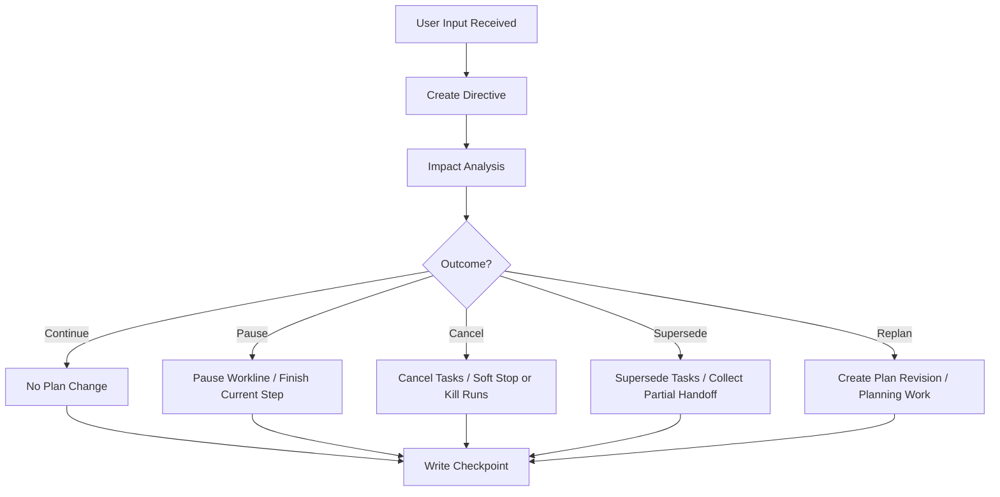

# 07 Runtime Directive Handling

## Purpose

- 定义运行中用户输入如何影响当前执行。
- 保证临时纠偏不会直接破坏对象状态一致性。
- 把用户插话收敛为结构化治理流程。

## Scope

- 本文覆盖 `Directive` 创建、影响分析、任务替换、运行中回收。
- Plan revision 的状态建模见状态模型分卷。

## Definitions

- `Runtime Directive`：运行中新增输入形成的结构化对象。
- `Impact Analysis`：评估对 Plan、Phase、Task、AgentRun 的影响。
- `Finish Current Step`：允许 run 在边界内收尾。

## Rules

### Directive Intake Rule

- 用户输入必须先进入 `UserInputReceived`。
- Orchestrator 必须把输入结构化为 `Directive`。
- `Directive` 未分析前，不得直接改 Task 状态。

### Impact Outcomes

- `continue`
- `pause`
- `cancel`
- `supersede`
- `replan`

### AgentRun Handling Rule

- `pause` 优先选择 `finish_current_step`。
- `cancel` 可选择 `soft_stop` 或 `hard_kill`。
- `supersede` 必须同时写替代关系与 handoff 回收策略。
- `replan` 必须生成新 revision 或 planning work item。

## Protocol Steps

1. 接收用户输入。
2. 创建 `Directive`。
3. 执行 impact analysis。
4. 判定 `continue / pause / cancel / supersede / replan`。
5. 更新 `Task` 与 `AgentRun` 的处置动作。
6. 写出 `Decision`、`Checkpoint` 和必要的 `Issue`。
7. 回到 Orchestrator reconcile loop。

## Mermaid Diagram

### Runtime Directive Handling Flow

## Anti-patterns

- 用户一句话直接修改 Task 文件。
- 运行中纠偏不做 impact analysis。
- supersede 旧任务但不处理活跃 `AgentRun`。
- 已取消工作线仍继续验收为完成。

## Acceptance Criteria

- 任一运行中用户输入都能回到 `Directive`。
- 任一 `Directive` 都能找到 impact analysis 与处理结果。
- 任一 supersede / cancel 都能说明活跃 run 的回收策略。
