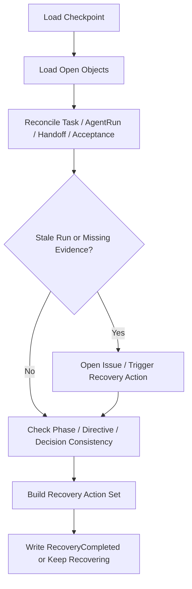

# 08 Recovery Reconciliation Checklist

## Purpose

- 定义恢复或上下文重建时的最小对账清单。
- 保证控制回合可结束、可恢复、可继续。

## Scope

- 本文覆盖 `Context Reset`、异常恢复、超时恢复后的对账步骤。
- 具体失败分类见 Failure Recovery Protocol。

## Definitions

- `Recovery Reconciliation`：恢复前对对象状态和运行实例做一致性核对。
- `Recovery Baseline`：恢复时所依赖的最新 `Checkpoint` 与开放对象集合。

## Rules

### Minimum Read Set

恢复时必须读取：

- latest `Checkpoint`
- active `Directive`
- active `Execution Plan` 与 plan revision
- current `Phase`
- open `Task`
- active / stale `AgentRun`
- open `Issue`
- pending `Decision`
- recent `Handoff`
- recent `Acceptance`

### Reconciliation Checks

- `Task` 与 `AgentRun` 状态是否一致
- phase gate 是否被错误推进
- 是否存在超时未处理的 run
- 是否存在未验收 handoff
- 是否存在未清理 blocker
- 是否存在未应用的 runtime directive

## Protocol Steps

1. 读取 latest `Checkpoint`。
2. 加载最小读取集合。
3. 核对 `Task / AgentRun / Handoff / Acceptance` 一致性。
4. 识别 stale run、未决 issue、未处理 directive。
5. 生成 recovery action set。
6. 写出 `RecoveryCompleted` 或继续保留 `RecoveryStarted`。

## Mermaid Diagram

### Recovery Reconciliation Flow

## Anti-patterns

- reset 后不重读对象，继续沿用旧上下文。
- 只看 Checkpoint，不看开放对象。
- 对账发现冲突后不写 `Issue`。
- 已有 stale run 仍继续派发新任务。

## Acceptance Criteria

- 任一恢复都能回到一份明确的 reconciliation checklist。
- 任一 stale run、未验收 handoff、未应用 directive 都能在恢复时被发现。
- 恢复完成后能清楚说明下一轮 control cycle 从哪里继续。
