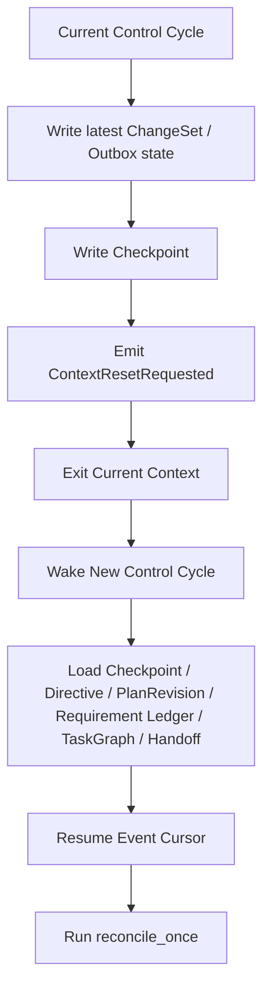

# 09 Context Reset and Session Continuity

## Purpose

- 把“总指挥上下文定期清空”定义成正常控制协议，而不是异常处理。
- 规定何时触发 context reset，reset 前必须写出哪些对象，reset 后第一轮如何恢复。
- 明确项目连续性如何通过 `Checkpoint`、`Directive`、`PlanRevision`、Requirement Ledger、`TaskGraph`、`Handoff` 恢复。

## Scope

- 本文保留为 context continuity 的概览说明。
- 完整的 vNext reset trigger、reset gate、handoff artifact 和 next-session recovery 协议见 `14-Context-Reset-and-Session-Handoff-Protocol.md`。
- 本文不讨论执行器内部 prompt 实现细节。
- 具体 control cycle 顺序见 `06-Orchestrator-Reconcile-Loop.md`。
- Worker 启动阶段见 `../05-execution/10-Worker-Session-Bootstrap-Checklist.md`。

## Definitions

- `Context Reset`：主动结束当前控制上下文，并在下一轮从外部状态重建工作连续性。
- `Reset Trigger`：触发一次 reset 的条件。
- `Recovery Baseline`：reset 前必须写出的可恢复状态摘要，通常由最新 `Checkpoint` 承担。
- `Session Continuity`：即使换了一轮上下文或换了一个 worker，也能基于结构化对象恢复项目连续性。

## Rules

### Context Reset 不是失败

- Context reset 是正常控制策略。
- 它的目的不是“忘记项目”，而是防止上下文污染、累积漂移和不可审计推断。
- 只要恢复基线完整，reset 后的 Orchestrator 与 Worker 都应能恢复到同一条结构化状态线上。

### Reset Trigger

出现以下任一条件时，应考虑触发 context reset：

- 当前控制回合已经完成一次稳定的 state transition，并写出 checkpoint。
- 当前上下文中存在过多历史讨论或临时推断，影响下一轮判断清晰度。
- 完成了一次重要的 `Directive`、`PlanRevision`、`Acceptance` 或 `RecoveryAction` 收敛。
- Worker 已退出，需要由新 session 接手。
- Orchestrator 需要从“已处理完当前轮事件”的稳定边界重新开始。

### Reset 前必须写出的对象

触发 reset 前，至少必须保证以下对象已 durable：

- 最新 `Checkpoint`
- 所有已提交但未发布完成的 `ChangeSet / Outbox` 状态
- 当前 active `Directive`
- 当前 `PlanRevision`
- 当前 Requirement Ledger 状态
- 当前 `TaskGraph` / open task set
- 最新 `Handoff`
- open `Issue`
- active / stale `AgentRun`

### Reset 后第一轮恢复规则

reset 后第一轮 `reconcile_once` 必须至少读取：

- 最新 `Checkpoint`
- active `Directive`
- active `PlanRevision`
- Requirement Ledger
- open tasks / active runs / active locks
- 最新 `Handoff`
- open issues
- event cursor 之后尚未消费的事件

### 连续性规则

- 项目连续性来自外部状态，不来自长对话上下文。
- Worker session continuity 也来自同一组结构化对象，而不是复用旧窗口。
- 若 reset 后发现对象之间存在冲突，应进入 recovery / reconcile，而不是靠旧上下文补脑。

## Protocol Steps

1. Orchestrator 在控制回合尾部评估是否满足 `Reset Trigger`。
2. 若满足，则先确保当前轮 change-set 与 checkpoint 写入完成。
3. 写出 `ContextResetRequested` 事件或等价 marker。
4. 结束当前控制上下文。
5. 下一轮被唤醒时，从最新 `Checkpoint`、`Directive`、`PlanRevision`、Requirement Ledger、`TaskGraph`、`Handoff` 等对象重建状态视图。
6. 恢复事件消费游标，继续 `reconcile_once`。
7. Worker 若需要继续执行，则按 `Worker Session Bootstrap Checklist` 重新获取 bearings。

## State / Schema

```yaml
context_reset_record:
  reset_id: reset_20260410_01
  requested_at: 2026-04-10T12:30:00Z
  reason: checkpoint_boundary_reached
  latest_checkpoint_id: checkpoint_20260410_05
  active_directive_ids:
    - dir_20260410_03
  active_plan_revision_id: plan_rev_12
  requirement_ledger_id: req_ledger_main
  open_task_ids:
    - task_auth_backend_07
  active_run_ids:
    - run_codex_005
  latest_handoff_ids:
    - handoff_20260410_04
  event_log_cursor: "184"
  reset_status: requested
```

## Mermaid Diagram

### context reset 前后恢复流程图



## Anti-patterns

- 把 context reset 当成失败回退，因此拖着旧上下文不放。
- reset 前没有写 checkpoint，就直接清空上下文。
- reset 后靠旧聊天记录恢复，而不是重新加载对象状态。
- Worker 不重新做 bearings，就继续沿用旧 session 假设。

## Acceptance Criteria

- 读者能明确知道 context reset 是正常控制策略。
- 读者能明确知道 reset 前必须写出的对象集合。
- 读者能明确知道 reset 后第一轮应如何恢复。
- 文档清楚说明连续性来自外部状态，而不是长上下文。
- 读者若需要可执行细则，应继续阅读 `14-Context-Reset-and-Session-Handoff-Protocol.md`。
