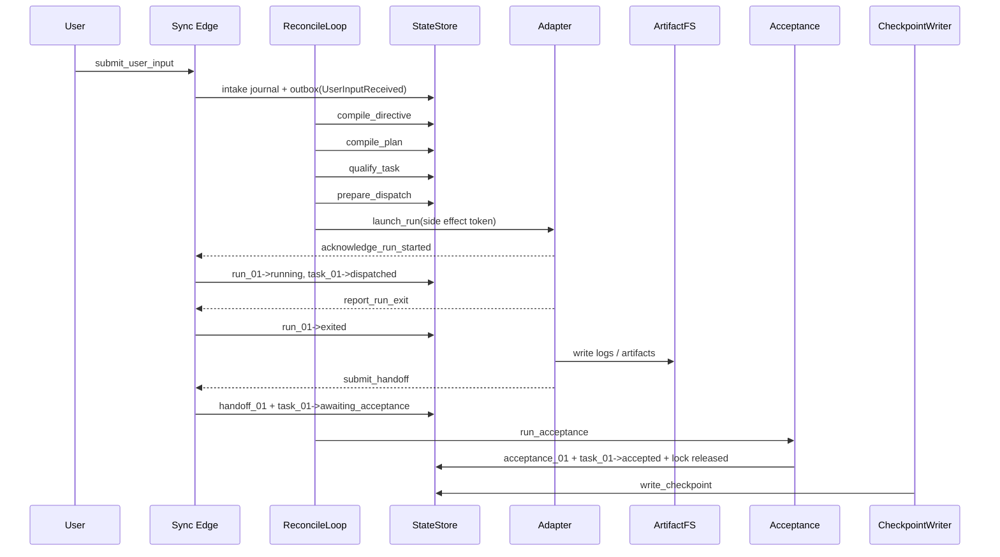
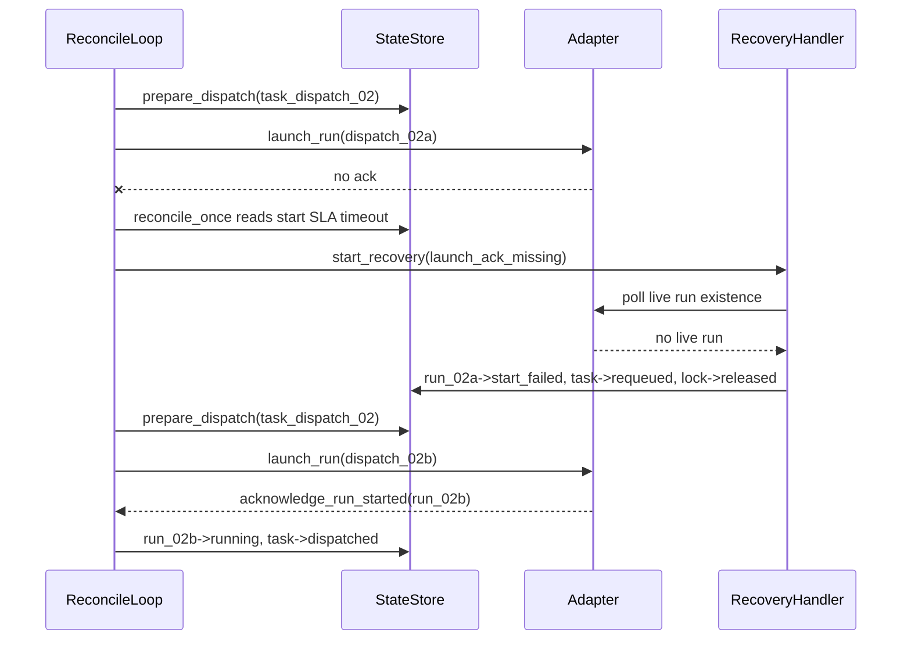
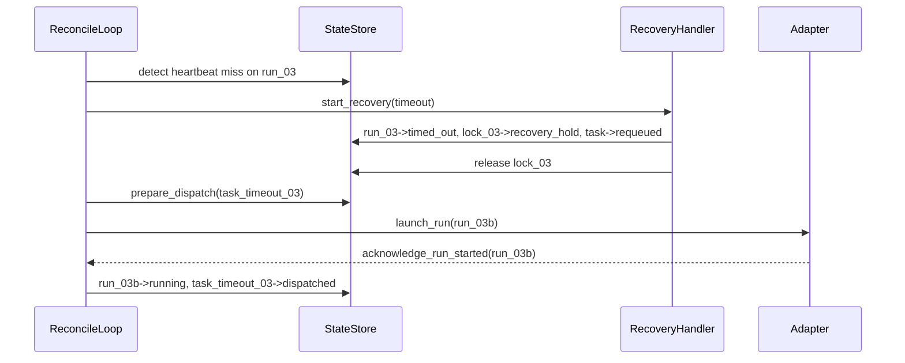
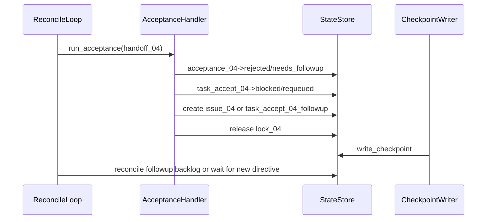

# 09 Golden Path and Failure Scenarios

## Purpose

- 把控制平面的 command、event、state、artifact 真正串成可执行的端到端场景。
- 明确首版实现里一次完整任务生命周期如何流转，以及失败后如何收敛而不重复派发、不双写失真、不错误 replay 外部副作用。
- 直接为 e2e 测试、fixture 设计和 recovery 验证提供脚本化蓝本。

## Scope

- 本文覆盖首版必须具备的 4 个核心场景。
- 本文只描述控制平面行为，不展开执行器内部实现细节。
- 本文聚焦 Layer 1 / MVP 控制平面场景；vNext 的用户插话与 context reset 协议见 `14-Context-Reset-and-Session-Handoff-Protocol.md` 与 `15-User-Interrupt-Replan-and-Preemption-Protocol.md`。
- 命令 contract 以 `../05-execution/11-Control-Plane-API-Contract.md` 为准。
- handler ownership 以 `../05-execution/14-Command-Handler-Blueprint.md` 为准。

## Definitions

- `Golden Path`：从用户输入到 checkpoint 完成的正常收敛链路。
- `Failure Path`：launch ambiguity、timeout、acceptance rejection 等需要 recovery 的链路。
- `Artifact Flow`：workspace / logs / validation outputs 如何经由 `Handoff` 被 `Acceptance` 消费。
- `Converged State`：系统完成本轮处理后达到的稳定状态，可安全继续下一轮 reconcile。

## Rules

### 场景编写规则

1. 每个场景都必须同时写出 command、emitted events、对象状态变化和 artifact 去向。
2. 每个场景都必须说明最终为什么不会重复派发或错误重放外部副作用。
3. 每个场景的最终状态都必须能作为下一轮 `reconcile_once` 的合法输入。

## Design Notes

### 场景 1：用户输入 -> directive -> plan -> task -> dispatch -> run -> handoff -> acceptance -> checkpoint

#### 初始状态

- 无 active `Directive`
- 无 active `PlanRevision`
- 无 `Task`
- 无 `AgentRun`
- 最新 `Checkpoint` 为空基线

#### 关键 command

1. `submit_user_input`
2. `compile_directive`
3. `compile_plan`
4. `qualify_task`
5. `prepare_dispatch`
6. `launch_run`
7. `acknowledge_run_started`
8. `report_run_exit`
9. `submit_handoff`
10. `run_acceptance`
11. `write_checkpoint`

#### Emitted Events

- `UserInputReceived`
- `RuntimeDirectiveCreated`
- `PlanCompiled`
- `TaskCreated`
- `TaskQualified`
- `DispatchPrepared`
- `LockAcquired`
- `AgentRunStarted`
- `TaskDispatched`
- `AgentRunExited`
- `HandoffSubmitted`
- `AcceptancePassed`
- `LockReleased`
- `CheckpointWritten`

#### 对象状态变化

| 对象 | 变化 |
|---|---|
| `Directive(dir_01)` | `created -> applied` |
| `PlanRevision(plan_rev_01)` | `compiled -> active` |
| `Phase(phase_01)` | `draft -> active` |
| `Task(task_01)` | `draft -> ready -> dispatching -> dispatched -> awaiting_acceptance -> accepted` |
| `DispatchIntent(dispatch_01)` | `prepared -> launch_requested -> acknowledged` |
| `AgentRun(run_01)` | `created -> starting -> running -> exited` |
| `Lock(lock_01)` | `requested -> reserved -> active -> released` |
| `Handoff(handoff_01)` | `submitted -> linked_to_acceptance` |
| `Acceptance(acceptance_01)` | `pending -> accepted` |
| `Checkpoint(checkpoint_01)` | `written` |

#### Artifact 流

- `launch_run` 为 `run_01` 分配 `workspace_ref`
- 执行器把日志写入 `var/logs/run_01/*`
- 运行产物写入 `var/artifacts/run_01/*`
- `submit_handoff` 只提交 `artifact_refs` 与 `validation_results`
- `run_acceptance` 读取 artifact refs，产出 `evidence_summary`
- `write_checkpoint` 不复制 artifacts，只记录 open object summary 和 `event_log_cursor`

#### 最终收敛状态

- `plan_rev_01` 为唯一 active revision
- `task_01 = accepted`
- `run_01 = exited`
- `lock_01 = released`
- `checkpoint_01` 成为最新恢复基线

#### 为什么不会重复派发 / 双写失真 / 错误 replay 外部副作用

- `prepare_dispatch` 在单一 change-set 中先写 `Task.dispatching + DispatchIntent + AgentRun + Lock`，因此同一 task 不能再次进入 ready dispatch。
- `launch_run` 只写 side effect token，不直接把 `run` 记为 `running`，因此即使 adapter 回调丢失也不会伪造成功状态。
- `event_log` 来自 outbox 发布，不存在“先写状态再 best-effort 发事件”的 blind dual-write。
- replay 只能重放 `Event` 到读模型或 recovery 判断，不能直接重放 `launch_run`。

#### Mermaid

### 场景 2：dispatch change-set 成功，但 launch 无确认

#### 初始状态

- `task_dispatch_02 = ready`
- 无 active `AgentRun`
- 无 active `Lock`
- 最新 checkpoint 已存在

#### 关键 command

1. `prepare_dispatch`
2. `launch_run`
3. `reconcile_once`
4. `start_recovery`
5. `prepare_dispatch`（仅在确认无 live run 后重新执行）
6. `launch_run`
7. `acknowledge_run_started`

#### Emitted Events

- `DispatchPrepared`
- `LockAcquired`
- 无立即启动成功事件
- `RecoveryStarted`
- `LockRecoveryHeld`
- `AgentRunStartFailed`
- `TaskRequeued`
- `LockReleased`
- 第二次成功时发出 `DispatchPrepared`、`AgentRunStarted`、`TaskDispatched`

#### 对象状态变化

| 对象 | 变化 |
|---|---|
| `Task(task_dispatch_02)` | `ready -> dispatching -> requeued -> dispatching -> dispatched` |
| `DispatchIntent(dispatch_02a)` | `prepared -> launch_requested -> failed_reconcile` |
| `AgentRun(run_02a)` | `created -> starting -> start_failed` |
| `Lock(lock_02a)` | `requested -> reserved -> recovery_hold -> released` |
| `RecoveryAction(recovery_02)` | `open -> resolved` |
| `DispatchIntent(dispatch_02b)` | `prepared -> launch_requested -> acknowledged` |
| `AgentRun(run_02b)` | `created -> starting -> running` |

#### 最终收敛状态

- 第一条 launch attempt 被显式记录为 `start_failed`
- task 重新进入可调度状态后才允许第二次派发
- 最终只有 `run_02b` 一个 active run

#### 为什么不会重复派发 / 双写失真 / 错误 replay 外部副作用

- 第一次 `prepare_dispatch` 已经把 task 置为 `dispatching`，因此在 recovery 结论出来前不会再次 `prepare_dispatch`。
- recovery 先检查 adapter 是否存在 live run，再决定 `start_failed + requeued`，不会盲目补发第二次 launch。
- `launch_run` 的 side effect token 记录了第一次外部动作请求，replay 时不会因为 event 重放再调一次 adapter。

#### Mermaid

### 场景 3：run 超时，进入 recovery，再 requeue

#### 初始状态

- `task_timeout_03 = dispatched`
- `run_03 = running`
- `lock_03 = active`
- 最新 checkpoint 指向当前 active revision

#### 关键 command

1. `report_heartbeat` 停止到达
2. `reconcile_once`
3. `start_recovery`
4. `prepare_dispatch`
5. `launch_run`
6. `acknowledge_run_started`

#### Emitted Events

- `AgentRunHeartbeatMissed`
- `AgentRunTimedOut`
- `RecoveryStarted`
- `LockRecoveryHeld`
- `TaskRequeued`
- `LockReleased`
- 新 attempt 的 `DispatchPrepared`
- `AgentRunStarted`
- `TaskDispatched`

#### 对象状态变化

| 对象 | 变化 |
|---|---|
| `AgentRun(run_03)` | `running -> timed_out` |
| `Lock(lock_03)` | `active -> recovery_hold -> released` |
| `Task(task_timeout_03)` | `dispatched -> requeued -> dispatching -> dispatched` |
| `RecoveryAction(recovery_03)` | `open -> resolved` |
| `AgentRun(run_03b)` | `created -> starting -> running` |

#### 最终收敛状态

- 超时 run 被保留为历史事实，不被覆盖
- task 在 recovery 之后重新入队
- 新 run 接管执行，旧锁被安全释放

#### 为什么不会重复派发 / 双写失真 / 错误 replay 外部副作用

- timeout 不是直接“创建新 run”，而是先创建 `RecoveryAction` 并把旧锁转为 `recovery_hold`。
- 在 `recovery_hold` 释放前，`prepare_dispatch` 不会为同一路径创建新 active lock。
- 旧 run 即使稍后补发退出事件，也只会被当作迟到事实处理，不会覆盖新 run 的 active 状态。

#### Mermaid

### 场景 4：acceptance rejected，生成 followup task 或 blocker

#### 初始状态

- `task_accept_04 = awaiting_acceptance`
- `run_04 = exited`
- `handoff_04 = submitted`
- `lock_04 = active` 或 `recovery_hold`

#### 关键 command

1. `run_acceptance`
2. `write_checkpoint`
3. `reconcile_once`
4. 若为 followup：`qualify_task -> prepare_dispatch`
5. 若为 blocker：等待 `Issue` / 新 `Directive`

#### Emitted Events

- `AcceptanceRejected` 或 `AcceptanceNeedsFollowup`
- 必要时 `IssueOpened`
- 必要时 `TaskCreated`
- `LockReleased`
- `CheckpointWritten`

#### 对象状态变化

| 对象 | 变化 |
|---|---|
| `Acceptance(acceptance_04)` | `pending -> rejected` 或 `needs_followup` |
| `Task(task_accept_04)` | `awaiting_acceptance -> blocked` 或 `requeued` |
| `Issue(issue_04)` | `open` |
| `Task(task_accept_04_followup)` | `draft -> ready`（仅 followup 路径） |
| `Lock(lock_04)` | `active/recovery_hold -> released` |
| `Checkpoint(checkpoint_04)` | `written` |

#### 最终收敛状态

- rejection 不会假装完成原 task
- 若问题可局部补救，则生成 followup task
- 若问题触及设计或需求边界，则创建 blocker issue，等待人工或新 directive

#### 为什么不会重复派发 / 双写失真 / 错误 replay 外部副作用

- 原 task 在 rejection 后不再处于 `dispatching / dispatched`，因此不会被重复当作“仍在执行”。
- followup task 是新对象，不会复用旧 dispatch intent 或旧 run。
- 释放锁与 acceptance 结论在同一 change-set 中提交，不会出现“验收失败但锁没释放”或“锁释放了但任务状态仍成功”的双写失真。

#### Mermaid

## Anti-patterns

- 场景只写“系统会自动恢复”，不写 command、event、state 和 artifact 去向。
- dispatch 失败后直接再调一次 adapter，而不先验证第一次是否真的没启动。
- acceptance rejected 之后直接把原 task 改成 `accepted` 或 `completed`。
- 用 replay 直接重放 `launch_run`、`kill_run` 之类外部动作。

## Acceptance Criteria

- 4 个场景都覆盖了首版最关键的 happy path 和 failure path。
- 每个场景都能落到具体 command、emitted events、对象状态变化和最终收敛状态。
- 工程师可以直接基于这些场景编写 e2e fixtures、fake adapter 脚本和 recovery tests。
- 每个场景都明确解释了为什么不会重复派发、不会双写失真、不会错误 replay 外部 side effect。

## MVP 落地检查表

- [x] 已给出完整 golden path：用户输入到 checkpoint。
- [x] 已覆盖 dispatch 无确认、run 超时、acceptance rejected 三类 failure path。
- [x] 每个场景都包含初始状态、关键 command、emitted events、对象状态变化、最终收敛状态和安全性说明。
- [x] 每个场景都附带 mermaid sequence diagram，可直接转成 e2e 用例。
- [ ] 仍需后续 ADR / spike 验证：真实 adapter 的 callback 时序、迟到 exit event 的处理细节。
- [ ] 明确不进入首版实现：跨仓恢复、跨 writer 事件竞争、复杂人工审批流。
