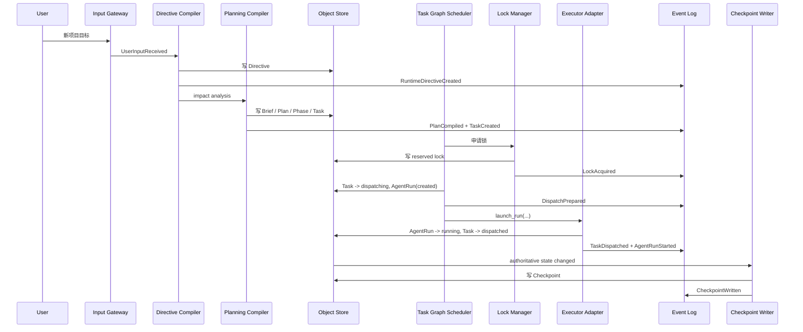
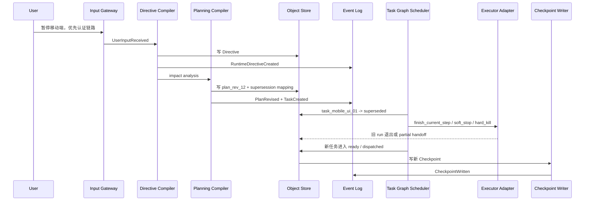
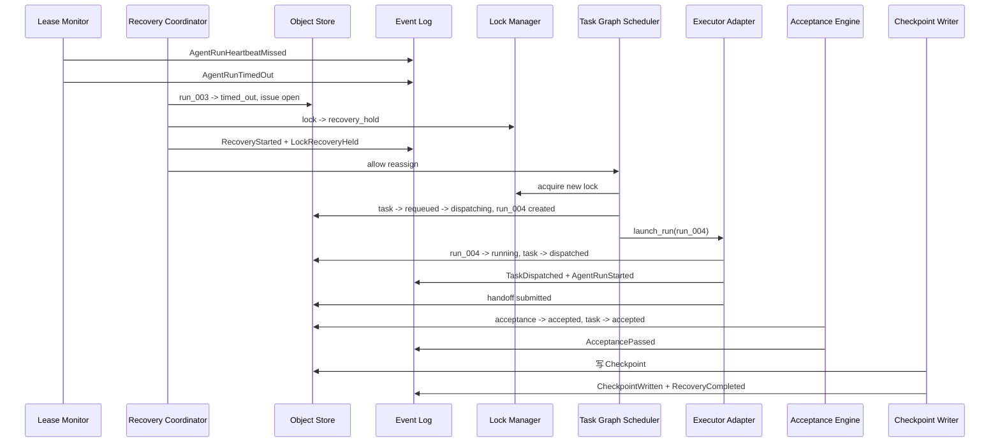

# 09 End-to-End Sequence Scenarios

## Purpose

- 用端到端时序把参考架构落到可模拟的系统行为。
- 明确对象 before / after、事件序列、状态变化、checkpoint 变化。
- 覆盖 happy path 与 failure path。

## Scope

- 本文覆盖三条关键运行链路：
  - 新项目启动
  - 运行中纠偏
  - run 超时恢复

## 场景 A：用户一句话启动新项目，直到首批 Task 成功派发

### 参与组件

- User
- Input Gateway
- Directive Compiler
- Planning Compiler
- Task Graph Scheduler
- Lock Manager
- Executor Adapter Layer
- Object Store / State Store
- Event Log
- Checkpoint Writer

### Before

- 无 active `Directive`
- 无 `Execution Plan`
- 无 `Task`
- 无 `AgentRun`
- 最新 `Checkpoint` 为空基线

### Event Sequence

1. `UserInputReceived`
2. `RuntimeDirectiveCreated`
3. `ResearchRequested`
4. `PlanCompiled`
5. `TaskCreated`
6. `TaskQualified`
7. `DispatchPrepared`
8. `LockAcquired`
9. `TaskDispatched`
10. `AgentRunStarted`
11. `CheckpointWritten`

### Key State Changes

| Object | Before | After |
|---|---|---|
| Directive | none | `applied` |
| Execution Plan Revision | none | `active(plan_rev_01)` |
| Phase | none | `active` |
| Task | none | `dispatched` |
| AgentRun | none | `running` |
| Lock | none | `active` |

### Checkpoint Delta

- active directive: `dir_001`
- current plan revision: `plan_rev_01`
- open tasks: `task_001`
- active runs: `run_001`
- active locks: `lock_001`

### Mermaid Diagram

## 场景 B：运行中用户纠偏，触发 directive -> plan revision -> task supersession -> run handling

### 参与组件

- User
- Input Gateway
- Directive Compiler
- Planning Compiler
- Task Graph Scheduler
- Executor Adapter Layer
- Object Store / State Store
- Event Log
- Checkpoint Writer

### Before

- `plan_rev_11` 为 active
- `task_mobile_ui_01 = dispatched`
- `run_ui_02 = running`
- `phase_ui = active`

### Event Sequence

1. `UserInputReceived`
2. `RuntimeDirectiveCreated`
3. `PlanRevised`
4. `IssueOpened`（如有冲突）
5. `TaskCreated`
6. `TaskQualified`
7. `HandoffSubmitted`（旧 run partial handoff，可选）
8. `CheckpointWritten`

### Key State Changes

| Object | Before | After |
|---|---|---|
| Directive | none | `applied` |
| Plan Revision | `plan_rev_11 active` | `plan_rev_12 active`, `plan_rev_11 superseded` |
| task_mobile_ui_01 | `dispatched` | `superseded` |
| run_ui_02 | `running` | `exited` 或 `killed`，取决于 `finish_current_step / hard_kill` |
| task_auth_backend_07 | none | `ready` 或 `dispatched` |

### Checkpoint Delta

- active directive: `dir_002`
- current plan revision: `plan_rev_12`
- superseded tasks: `task_mobile_ui_01`
- new ready tasks: `task_auth_backend_07`
- run handling decision recorded

### Mermaid Diagram

## 场景 C：AgentRun 超时，进入 recovery -> reassign -> acceptance -> checkpoint

### 参与组件

- Lease / Heartbeat Monitor
- Recovery Coordinator
- Lock Manager
- Task Graph Scheduler
- Executor Adapter Layer
- Acceptance Engine
- Object Store / State Store
- Event Log
- Checkpoint Writer

### Before

- `task_auth_backend_07 = dispatched`
- `run_codex_003 = running`
- `lock_auth_write_07 = active`
- `phase_auth = active`

### Event Sequence

1. `AgentRunHeartbeatMissed`
2. `AgentRunTimedOut`
3. `IssueOpened`
4. `RecoveryStarted`
5. `LockRecoveryHeld`
6. `DispatchPrepared`
7. `TaskDispatched`
8. `AgentRunStarted`
9. `HandoffSubmitted`
10. `AcceptancePassed`
11. `CheckpointWritten`
12. `RecoveryCompleted`

### Key State Changes

| Object | Before | After |
|---|---|---|
| AgentRun(run_codex_003) | `running` | `timed_out` |
| Lock(lock_auth_write_07) | `active` | `recovery_hold -> released` |
| Task(task_auth_backend_07) | `dispatched` | `requeued -> dispatched -> accepted` |
| AgentRun(run_codex_004) | none | `running -> exited` |
| Acceptance | none | `accepted` |

### Checkpoint Delta

- timed out run archived in issue refs
- active run switched to `run_codex_004`, then cleared after acceptance
- task moved to completed set
- stale lock issue resolved

### Mermaid Diagram

## Anti-patterns

- 场景只描述“系统会处理”，不写事件和对象变化。
- 用户纠偏时直接改任务，不写 Directive 和 revision。
- run 超时后直接重派，不先处理锁与旧 run 状态。

## Acceptance Criteria

- 每个场景都能回到具体事件、对象和 checkpoint 变化。
- 实现方可据此模拟控制平面行为。
- 场景同时覆盖 happy path、supersession、timeout recovery。
