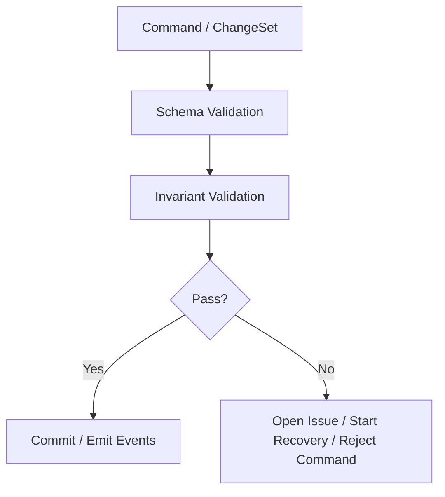

# 10 Invariants and Conformance Rules

## Purpose

- 定义 Hive 的系统级不变量。
- 为实现、测试、审计和恢复提供统一的 conformance baseline。
- 收敛“什么绝不能被破坏”。

## Scope

- 本文覆盖控制平面的一致性、调度、锁、验收、恢复相关 invariants。
- 具体对象 schema 与 command contract 以对应章节为准。

## Rules

### Invariant Table

| Invariant | Why It Matters | Violation Symptom | Detection Method | Recovery / Mitigation |
|---|---|---|---|---|
| 一个 `Task` 在同一时刻最多只能有一个 active write-conflicting `AgentRun` | 防止双写与竞态 | 同一任务对应多个写冲突 run 同时 running | task_id + active lock / run join check | 冻结新派发，kill / supersede 多余 run，写 Issue |
| `accepted` task 必须有 `Acceptance` record | 防止把 handoff 当完成 | task 已 accepted 但无 acceptance_id | task state audit | 回退 task 到 `awaiting_acceptance` 或重跑 acceptance |
| active `Lock` 必须绑定 `owner_run_id` | 保证锁可追溯与可回收 | active lock 无 owner | lock conformance scan | 转 `recovery_hold`，写 lock issue，必要时 force release |
| `Checkpoint` 不得反向覆盖 authoritative object state | 防止恢复快照污染事实 | recovery 时 checkpoint 值把对象回滚 | recovery reconciliation audit | 以 object state 为准，checkpoint 重写 |
| replay 不得重复执行外部 side effect | 防止重复 launch / kill / notify | 同一 run 被重复启动 | side effect token audit | 阻止重复 side effect，仅补发事件 |
| `superseded` task 不得进入新的普通派发流 | 保证 supersession 生效 | superseded task 再次被 dispatch | scheduler guard | 取消 dispatch intent，写 Issue |
| `dispatching` task 未经 recovery reconciliation 不得重复派发 | 避免 launch ack 丢失时重复 run | task dispatching 时又出现新 run | dispatch intent uniqueness check | 启动 recovery，核实旧 run 真状态 |
| `run timed_out` 不得直接推导 `task accepted` | 保持执行与验收分离 | timed_out 后 task 变 completed | task / run transition audit | task 改为 requeued / blocked，走 recovery |
| `Handoff` 不等于 `Acceptance` | 保持执行声明与验收分离 | handoff submitted 后 task 直接 accepted | state transition audit | 回退 task，补 acceptance |
| `Event Log` 中同一 `idempotency_key` 不得产生多次状态推进 | 保证幂等消费 | 重复 event 导致重复派发 | event dedup audit | 标记 duplicate，回放修正 |
| `Lock.recovery_hold` 超过 TTL 必须处理 | 防止长期占锁 | recovery_hold 永久存在 | stale lock scan | force release 或升级 Issue |
| 一个 active `Plan Revision` 在同一 Execution Plan 上最多只能有一个 | 保证任务图来源唯一 | 同一 plan 同时两个 active revision | revision conformance scan | 保留较新 revision，旧 revision 标 superseded |

## Detailed Conformance Checks

### Dispatch Conformance

- `Task.status = dispatching` 时必须存在 `DispatchIntent`。
- `DispatchIntent` 必须绑定 `run_id`、`executor_name`、`workspace_ref`。
- `Task.status = dispatched` 时必须存在 active `AgentRun` 或可验证的 handoff intake。

### Acceptance Conformance

- `Acceptance.status = accepted` 时，对应 task 必须为 `accepted`。
- `Acceptance.status = partial_accepted` 时，对应 task 不得直接为 `accepted`。
- `Acceptance.status = needs_followup` 时，必须存在 followup action。

### Recovery Conformance

- `RecoveryStarted` 后，必须能找到至少一个 recovery reason 与相关对象。
- `RecoveryCompleted` 前，stale run 或 stale lock 不得继续作为 healthy input 进入调度。

## Mermaid Diagram

### Conformance Guard Layers

## Anti-patterns

- 只有对象 schema，没有系统级 invariant。
- invariant 被破坏后仅写日志，不触发修复动作。
- 把 conformance 检查留到线上事故后再做。

## Acceptance Criteria

- 每条 invariant 都有 statement、symptom、detection、recovery。
- 实现方可据此设计 invariant checker、审计任务或数据库约束。
- conformance 结果能直接回连到 recovery / issue 流。
