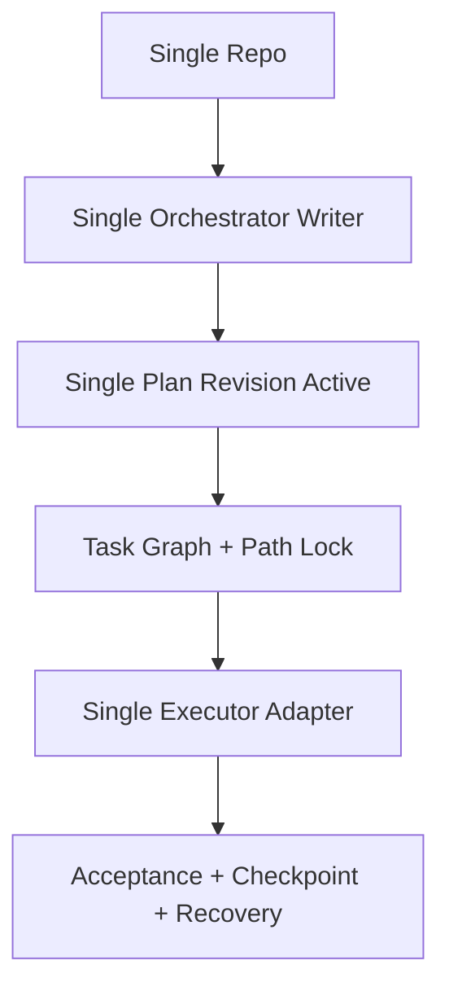

# 11 Minimum Viable Control Plane

## Purpose

- 定义从 v0.4 文档到 first implementation 的最小切片。
- 限制首版实现范围，避免一上来做全功能系统。
- 明确“先实现什么，不实现什么”。

## Scope

- 本文定义 MVP slice，不定义最终架构上限。
- MVP 必须仍然保持核心控制平面语义成立。

## MVP Included

- 单仓库
- 单 active execution plan
- 单 Orchestrator writer
- 单 executor adapter
- path lock
- 无 repo federation
- 无 live restore hard dependency
- basic acceptance engine
- basic checkpointing
- basic recovery reconciliation
- manual Queen escalation

## MVP Excluded

- 多仓库编排
- 多 Orchestrator 并发写
- 跨 executor 策略优化
- 自动 plan optimizer
- repo federation
- live restore required path
- executor-specific rich UI integrations
- fine-grained policy engine automation

## Rules

### MVP Design Constraints

- 只能有一个 authoritative writer 更新 object state。
- `rehydrate + reassign` 是唯一必须支持的恢复路径。
- lock 粒度先支持 `path`，`repo` 与 `module` 只保留 schema 与语义。
- Queen 不落为运行时组件，只保留人工升级路径。
- Acceptance 先只支持 canonical evidence set，不做 executor-specific scoring。

### MVP Required Components

- Input Gateway
- Directive Compiler
- Planning Compiler
- Task Graph Scheduler
- Executor Adapter Layer（单实现）
- Lease / Heartbeat Monitor（host-side）
- Acceptance Engine
- Recovery Coordinator
- Lock Manager（最少 path lock）
- Object Store / State Store
- Event Log
- Checkpoint Writer

### MVP Required Commands

- `submit_user_input`
- `compile_directive`
- `compile_plan`
- `qualify_task`
- `prepare_dispatch`
- `launch_run`
- `acknowledge_run_started`
- `report_run_exit`
- `submit_handoff`
- `run_acceptance`
- `write_checkpoint`
- `start_recovery`
- `reconcile_once`

## Suggested First Implementation Order

1. 实现 canonical registry 和 schema validator
2. 实现 Object Store / State Store
3. 实现 ChangeSet + Outbox
4. 实现 Event Log append / dedup
5. 实现 `submit_user_input -> compile_directive -> compile_plan`
6. 实现 `qualify_task -> prepare_dispatch -> launch_run`
7. 实现 path-only Lock Manager
8. 实现 `report_run_exit -> submit_handoff -> run_acceptance`
9. 实现 `write_checkpoint -> start_recovery -> reconcile_once`
10. 最后补 executor validation harness

## Mermaid Diagram

### MVP Slice

## Implementation Notes

- MVP 不是最终能力上限。
- MVP 的目标是验证：state / event / change-set / acceptance / recovery 这五条主链是否可稳定协同。
- 只要这五条主链成立，后续再扩多 executor、多 repo、多 writer 才有意义。

## Anti-patterns

- MVP 仍试图一次支持多仓库、多 adapter、多 writer。
- 在 restore fidelity 未验证前把 live restore 做成核心路径。
- 在没有 change-set 之前先做花哨的 UI 或策略层。

## Acceptance Criteria

- 实现方能基于本文划清 first implementation 的边界。
- MVP 包含的能力足以验证 Hive 是否能作为控制平面闭环运行。
- 排除项明确，不会在首版实现中偷偷回流。
