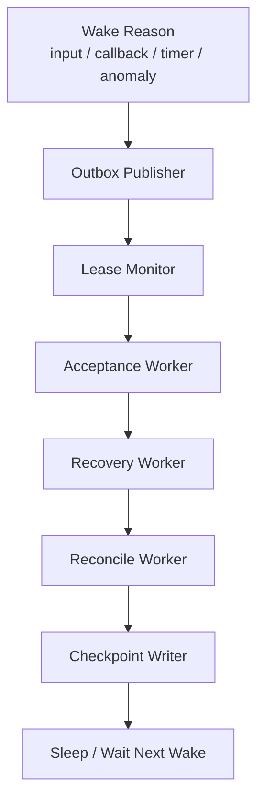
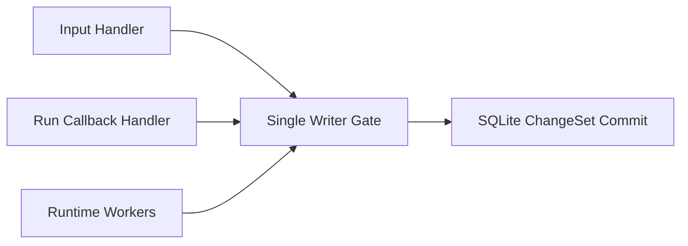

# 12 Reconcile Worker and Event Processor Blueprint

## Purpose

- 为 Hive MVP 明确最简运行时 worker 模型。
- 回答 reconcile、event processing、acceptance、recovery、checkpoint、lease monitor 在首版里怎么跑。
- 把 v0.4 的回路协议收敛成首版可实施的 runtime blueprint。

## Scope

- 本文面向 MVP 单 writer、单进程 runtime。
- 本文不改变 `reconcile_once(...)`、`start_recovery(...)`、`run_acceptance(...)` 等命令语义。
- 控制平面对象与事件语义仍以既有章节为准。

## Definitions

- `Runtime Loop`：首版 `control-plane` 进程中的后台循环。
- `Wake Reason`：触发一次 reconcile / worker 扫描的原因。
- `Event Processor`：处理 outbox -> event log 与 event cursor 的运行时子职责。
- `Single Writer Gate`：保证同一时刻只有一个状态推进路径提交 change-set 的执行约束。

## Recommended MVP Runtime Model

首版推荐：

- 一个 `control-plane` 进程
- 一个 single writer gate
- 一个简单 job loop
- 多个逻辑 worker 作为同进程子循环，而不是多个独立 OS process

推荐顺序：

1. drain ingress wake signals
2. publish pending outbox
3. poll active runs / lease state
4. execute acceptance backlog
5. execute recovery backlog
6. run `reconcile_once`
7. write checkpoint if state changed
8. sleep or wait for next wake

## Who Triggers `reconcile_once`

首版 `reconcile_once` 由 runtime 自己触发，触发源包括：

- `submit_user_input` 提交成功
- `acknowledge_run_started` 提交成功
- `report_run_exit` 提交成功
- `submit_handoff` 提交成功
- `start_recovery` 创建了 recovery action
- 定时器 tick
- lease / heartbeat monitor 发现异常
- outbox publisher 完成一批事件发布后

首版推荐策略：

- 事件驱动唤醒为主
- 周期性定时器兜底

原因：

- 只靠事件驱动，容易遗漏进程内信号丢失后的补扫。
- 只靠定时轮询，又会让响应变慢。

## Event Processor and Reconcile Worker

### 首版结论

- `event processor` 与 `reconcile worker` 推荐在同一进程内。
- 它们可以是不同代码模块，但不应先拆成不同部署单元。

### 原因

- outbox publish、event cursor 推进、reconcile 读取 authoritative state 必须共享一致的时序理解。
- 首版最需要验证的是“状态提交后，事件被发布，reconcile 下一轮能看到正确输入”。
- 若一开始拆为两个写进程，会把单 writer 语义打散。

## Outbox Publisher Blueprint

### 首版怎么跑

- 由同进程 runtime loop 在每轮开始时先跑一次。
- 只负责读取 `outbox_events(pending)`。
- append 到 `event_log` 后，将对应 outbox 置为 `published`。
- 若失败，保持 `failed` 或 `pending` 并交给下一轮重试。

### 首版为什么先这样

- 它已经满足 v0.4 的 `authoritative state + outbox + async publish` 语义。
- 不需要先引入 MQ 或额外 publisher 进程。

## Lease Monitor Blueprint

### 首版怎么跑

- 由同进程 runtime loop 在 outbox publisher 之后执行。
- 读取 active `AgentRun` 与 active / recovery_hold `Lock`。
- 对每个 run 检查：
  - `start_sla_expires_at`
  - `last_heartbeat_at`
  - `lease_expires_at`
- 发现异常时不直接重派，只提交：
  - `AgentRunHeartbeatMissed`
  - `AgentRunTimedOut`
  - recovery marker / recovery action

### 首版为什么必须 host-side

- 当前 capability matrix 已明确 heartbeat source 不能依赖 executor 内建语义。
- 因此 lease monitor 必须由 Hive 自己拥有。

## Acceptance Worker Blueprint

### 首版怎么跑

- 由同进程 runtime loop 在 lease / timeout 检查之后执行。
- 只处理 `Task.status = awaiting_acceptance` 或 `Handoff.status = submitted / ingested` 的 backlog。
- 每轮可以按固定批量处理，默认小批次串行，避免与 recovery / dispatch 争抢写窗口。

### 首版边界

- acceptance worker 只产生 `Acceptance` 与 followup action。
- 不直接触发新的 external side effect。

## Recovery Worker Blueprint

### 首版怎么跑

- 由同进程 runtime loop 在 acceptance 之后执行。
- 消费来源：
  - timed out run
  - stale lock
  - launch ack missing
  - replay anomaly
  - operator-triggered recovery
- 统一提交 `RecoveryAction` 状态推进，并在需要时把对象移入 `requeued`、`blocked`、`recovery_hold`。

### 首版边界

- recovery worker 负责决定是否允许再次进入调度。
- recovery worker 不直接调用 planning 编译器重写 plan；若需要 replan，写 issue / followup action。

## Checkpoint Writer Blueprint

### 首版怎么跑

- 由同进程 runtime loop 在 `reconcile_once` 尾部执行。
- 仅当本轮 authoritative state 或 event cursor 发生变化时写 checkpoint。
- 与 accept / recover / dispatch 一样，仍通过 single writer gate 提交。

### 首版触发条件

- `PlanRevision` 新激活
- `Task` 状态发生批量变化
- `AgentRun` 生命周期推进
- `Acceptance` 产生新结果
- `RecoveryAction` 完成或重要阶段切换

## Recommended Job Loop Order

首版推荐固定顺序：

1. `outbox publisher`
2. `lease monitor`
3. `acceptance worker`
4. `recovery worker`
5. `reconcile_once`
6. `checkpoint writer`

理由：

- 先发布 outbox，减少 event / state 视图落差。
- 先处理超时与恢复，避免带病继续派发。
- 先处理 acceptance，避免积压 handoff。
- dispatch 只在 recovery / acceptance 后进行，防止系统在异常未清时继续扩散并发。

## How MVP Avoids Multi-writer Contention

首版推荐以下约束同时成立：

- 所有写命令通过同一 `control-plane` 进程执行。
- 所有 change-set 提交通过同一 serialized command executor 排队。
- SQLite 只使用一个主 writer 连接。
- 外部回调不直接绕过该 writer gate。

这意味着：

- 即使有多个 HTTP 请求或 adapter callback 同时到达，也只是在进程内排队。
- authoritative state 只有一个提交序列。
- 不需要在 MVP 阶段先做 leader election。

## What Can Be Split Later

在以下条件满足后，才建议拆 worker：

- conformance suite 已覆盖 replay、duplicate dispatch、stale lock、timeout recovery
- `ChangeSet` 与 outbox 语义已稳定
- 单 writer 模式已在线下证明闭环稳定

后续可拆分的候选：

- 独立 outbox publisher
- 独立 acceptance worker
- 独立 recovery worker
- 独立 lease monitor

后续仍应最后再拆的部分：

- `reconcile_once`
- single writer gate

原因：

- 它们是 authoritative state 推进的核心序列，不宜过早并行化。

## Mermaid Diagram

### MVP Runtime Loop

### Single Writer Gate

## Anti-patterns

- 首版就把 outbox publisher、recovery、acceptance 拆成多个并发写进程。
- `reconcile_once` 不固定顺序，哪轮想先 dispatch 就先 dispatch。
- lease monitor 发现超时后直接重派，不写 recovery action。
- callback 线程直接更新数据库，绕开 single writer gate。
- event processor 自己推导业务状态，而不是只处理事件发布。

## Acceptance Criteria

- 工程师能明确知道首版推荐的是同进程 simple job loop。
- 工程师能明确知道 `reconcile_once` 的触发源、执行顺序和单 writer 约束。
- 工程师能明确知道 outbox、lease、acceptance、recovery、checkpoint 各自怎么跑。
- 工程师能明确知道哪些 worker 未来可拆，哪些不应在 MVP 先拆。
