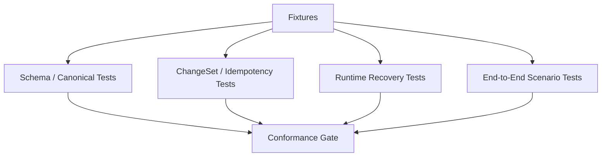

# 13 Conformance Test Strategy

## Purpose

- 把 v0.4 的 invariants 转成首版实现前可执行的测试策略。
- 为 Hive MVP 提供最小 conformance gate。
- 让实现仓在开工时就有 fixture、assertion 和 failure symptom，而不是等线上事故再补。

## Scope

- 本文覆盖 schema、change-set、idempotency、dispatch、lock、recovery、acceptance、replay 与 end-to-end 场景。
- 本文面向首个实现仓的测试与验证，不替代对象协议文档。

## Definitions

- `Conformance Fixture`：为了验证某条规则而准备的固定输入集。
- `Expected Assertion`：实现必须满足的可程序化断言。
- `Failure Symptom`：该类问题在运行时最典型的错误表现。
- `Fake Adapter`：用于模拟 executor 行为的测试替身。

## Recommended MVP Test Harness

首版推荐统一使用：

- 临时 `SQLite` 数据库
- 临时 `filesystem artifact root`
- fake clock
- fake adapter
- golden schema fixtures
- end-to-end scenario seeds

首版 fake adapter 必须至少能模拟：

- launch success
- launch ack missing
- heartbeat missing
- timeout
- normal exit
- partial handoff
- artifact missing

## Minimal Conformance Gate

首版建议把测试分成四层：

1. `schema gate`
2. `change-set gate`
3. `runtime gate`
4. `scenario gate`

只有四层全部通过，才能认为 MVP control plane 闭环可接受。

## 1. Schema Validation Tests

### Target

- 所有核心对象、事件、change-set、dispatch intent、recovery action 都符合 schema catalog。

### Fixture

- `tests/fixtures/schema/valid/*.yaml`
- `tests/fixtures/schema/invalid/*.yaml`
- 覆盖对象：
  - `Directive`
  - `PlanRevision`
  - `Task`
  - `AgentRun`
  - `Handoff`
  - `Acceptance`
  - `Lock`
  - `Checkpoint`
  - `Event`
  - `ChangeSet`

### Expected Assertion

- valid fixture 全部通过 validator。
- invalid fixture 必须失败，并指出缺失字段或非法 enum。

### Failure Symptom

- 运行时才能发现字段缺失。
- status / event name 拼写漂移。
- handler 对 payload 形状各自做隐式猜测。

## 2. Enum / ID Canonicalization Tests

### Target

- 所有 status、event name、ID prefix、command name 都符合 canonical registry。

### Fixture

- `tests/fixtures/canonical/enum_cases.yaml`
- `tests/fixtures/canonical/id_cases.yaml`
- 同时包含合法写法和 legacy forms：
  - `partial_accepted` vs `partial-accept`
  - `checkpoint_` vs `cp_`
  - `start_failed` vs `start-failed`

### Expected Assertion

- canonical cases 通过。
- legacy form 被拒绝或被显式 canonicalize。
- 任一 ID 都能匹配固定 prefix + opaque suffix 规则。

### Failure Symptom

- 不同 handler 对同一状态使用不同拼写。
- replay / query 无法正确 join。
- audit 与调试时出现同义不同写。

## 3. Change-set Apply Tests

### Target

- `ChangeSet Applier` 的 apply order、事务边界、before/after delta、outbox durable 语义。

### Fixture

- 直接复用 `08-appendix/12-Command-and-ChangeSet-Examples.md` 的 canonical 示例：
  - `submit_user_input`
  - `prepare_dispatch`
  - acceptance change-set
  - `start_recovery`

### Expected Assertion

- object delta、lock delta、outbox events 在同一 transaction 内 durable。
- `before` 与 `after` 被完整记录。
- commit 失败时无外部 side effect 被标记为已执行。

### Failure Symptom

- 状态已更新但 outbox 缺失。
- 锁状态与 task 状态脱节。
- recovery 无法追溯 change-set 边界。

## 4. Idempotency Tests

### Target

- 同一 command / event / callback 重复送达时不会重复推进状态。

### Fixture

- 重复调用：
  - `submit_user_input`
  - `acknowledge_run_started`
  - `report_run_exit`
  - `run_acceptance`
  - `write_checkpoint`

### Expected Assertion

- 同一 `idempotency_key` 只产生一次有效状态推进。
- 重复请求返回相同结果或无副作用重放。
- `event_log` 不会为同一逻辑动作追加多条生效记录。

### Failure Symptom

- 同一输入创建多个 directive。
- 同一 run 被多次启动或多次 exit。
- 同一 handoff 被多次 acceptance。

## 5. Duplicate Dispatch Prevention Tests

### Target

- `dispatching` 期间不能重复派发同一 task。

### Fixture

- 一个 `Task(ready)`。
- 一次 `prepare_dispatch` 成功。
- `launch_run` ack 丢失，run 保持 `created / starting`。
- 在 start SLA 过期前再次触发 `reconcile_once`。

### Expected Assertion

- 不会生成第二个 active `DispatchIntent`。
- 不会生成第二个 active `AgentRun`。
- task 保持 `dispatching`，直到 recovery 明确接管。

### Failure Symptom

- 同一 task 同时出现多个 run。
- 两个 worker 并发写同一路径。
- 锁出现重复 owner。

## 6. Stale Lock Recovery Tests

### Target

- `Lock.recovery_hold`、`force_release`、stale lock 扫描与 issue 记录。

### Fixture

- 一个 `Lock(active)` 绑定到已 `timed_out` 的 `AgentRun`。
- 或一个 `Lock(recovery_hold)` 其 `recovery_hold_until` 已过期。

### Expected Assertion

- stale lock 被识别。
- 锁进入 `recovery_hold` 或 `force_released` 的规范状态推进成立。
- 必要时创建 `Issue(type=lock_conflict or recovery_anomaly)`。

### Failure Symptom

- 锁永久占用。
- healthy task 长期无法重新派发。
- 恢复日志里只有提示，没有结构化对象变化。

## 7. Timeout Recovery Tests

### Target

- `AgentRunHeartbeatMissed`、`AgentRunTimedOut`、`RecoveryStarted`、requeue / reassign 路径。

### Fixture

- fake adapter 启动 run 后停止 heartbeat。
- fake clock 推进超过 `lease_expires_at`。
- task 仍未收到 handoff。

### Expected Assertion

- run 进入 `timed_out`。
- 锁进入 `recovery_hold`。
- task 进入 `requeued` 或 `blocked`，而不是 `accepted`。
- `RecoveryAction` 被创建并可继续推进。

### Failure Symptom

- timed out run 仍被当成 healthy input。
- task 被错误地当成完成。
- recovery 未冻结冲突锁就直接重派。

## 8. Acceptance Evidence Tests

### Target

- `Acceptance Input Set`、证据完整性、partial handoff 处理。

### Fixture

- `complete` handoff + 完整 artifacts + validation pass
- `partial` handoff + 缺少 integration evidence
- `failed` handoff + logs only

### Expected Assertion

- 完整证据得到 `accepted`。
- partial handoff 只能得到 `partial_accepted` 或 `needs_followup`。
- 证据缺失不会得到 `accepted`。

### Failure Symptom

- worker 自报完成即通过。
- handoff 与 acceptance 混为一谈。
- 缺少 followup action 却产生 `needs_followup`。

## 9. Replay Safety Tests

### Target

- replay 只重建事件视图，不重放外部 side effect。

### Fixture

- 已存在：
  - `changeset`
  - `outbox_events(published)`
  - `event_log`
  - `external_side_effect token`
- 对同一 event window 执行 replay。

### Expected Assertion

- 不会再次执行 `launch_run(...)`、`kill_run(...)` 等 side effect。
- 只能重建 read model、补齐 cursor、校验 dedup。
- 若发现状态 / 事件偏差，创建 recovery action，而不是直接重派。

### Failure Symptom

- replay 导致重复启动 run。
- outbox 补发时又改动 authoritative state。
- audit 链出现重复 side effect。

## 10. End-to-End Scenario Tests

### Target

- 按文档场景验证首版闭环行为，而不是只看单点单元测试。

### Fixture

- 直接对齐 `09-End-to-End-Sequence-Scenarios.md`：
  - 场景 A：新项目启动直到首批 task 派发
  - 场景 B：运行中 directive -> plan revision -> supersession
  - 场景 C：run timeout -> recovery -> reassign -> acceptance

### Expected Assertion

- 场景 A：`Directive -> PlanRevision -> Task -> DispatchIntent -> AgentRun -> Checkpoint` 全链成立。
- 场景 B：旧 revision superseded、新 revision active、受影响 task / run 处理符合文档。
- 场景 C：timed_out run 不会直接完成 task，recovery 后新 run 能完成 acceptance。

### Failure Symptom

- 端到端路径中断在 planning / dispatch / acceptance / recovery 任一处。
- checkpoint 与对象事实不一致。
- plan supersession 没有正确影响 active task。

## Fixture Plan

首版建议至少准备以下 fixture 目录：

```text
tests/fixtures/
├── schema/
├── canonical/
├── changesets/
├── events/
├── scenarios/
│   ├── scenario_a_new_project/
│   ├── scenario_b_runtime_directive/
│   └── scenario_c_timeout_recovery/
└── adapters/
    └── fake_codex/
```

每个 scenario fixture 建议包含：

- seed objects
- expected event sequence
- expected final object states
- expected checkpoint summary

## Test Execution Recommendation

首版建议的最小执行顺序：

1. `schema gate`
2. `canonical gate`
3. `change-set gate`
4. `runtime gate`
5. `scenario gate`

只要某一层失败，就不应继续宣称 MVP 控制平面闭环可用。

## Mermaid Diagram

### Conformance Harness



## Anti-patterns

- 只写“以后要有测试”，没有 fixture 与 assertion。
- 只做 happy path，不做 duplicate dispatch、timeout、stale lock。
- end-to-end 测试只看日志，不看最终对象状态与 checkpoint。
- 把 replay 测试写成再次执行外部 side effect。

## Acceptance Criteria

- 每类核心风险都有明确的 target、fixture、expected assertion、failure symptom。
- 实现仓可以直接据此建立最小 conformance gate。
- 测试策略与现有 invariants、E2E scenarios、change-set 示例保持一致。
- 首版实现的关键回归面已经被系统性覆盖。
