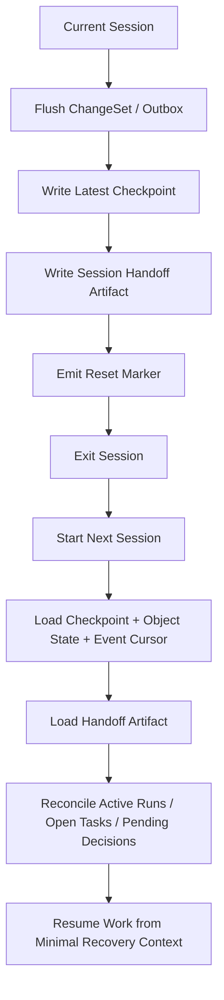

# 14 Context Reset and Session Handoff Protocol

## Purpose

- 把 context reset 从“存在一个命令”提升为完整协议。
- 明确 reset trigger、reset gate、reset 前提、handoff artifact、checkpoint 依赖与恢复流程。
- 让 Hive 在长期自治场景下依靠外部状态和结构化 handoff 持续工作，而不是依赖越来越长的上下文。

## Scope

- 本文覆盖 Orchestrator、Planner、Research、Execution、Evaluator 等角色的 session handoff 与 reset 协议。
- 本文不改变当前 MVP 的对象事实层级与 change-set / outbox 语义。
- 概览说明见 `09-Context-Reset-and-Session-Continuity.md`。

## Definitions

- `Context Reset`：主动结束当前 session，并要求下一轮从外部状态重建最小必要上下文。
- `Reset Trigger`：触发 reset 候选的条件。
- `Reset Gate`：允许本次 reset 真正发生前必须满足的条件。
- `Handoff Artifact`：为下一轮 session 准备的结构化接力包。
- `Minimal Recovery Context`：下一轮恢复所需的最小对象与引用集合。
- `Reset Barrier`：在 reset 前必须 durable 的对象与 marker 集合。

## Rules

### Reset 不是失败补丁

- context reset 是正常控制机制。
- reset 的目标是降低上下文污染、减少漂移、维持可审计推理边界。
- 只要 reset barrier 完整，换 session 不应改变项目真相。

### Reset Trigger

出现以下任一条件时，应评估 reset：

| Trigger | 说明 |
|---|---|
| context 逼近上限 | 当前会话承载的信息量过高，继续推进会降低判断质量 |
| 计划阶段切换 | 一个 planning / execution / evaluation 阶段稳定收敛，适合切边界 |
| 连续失败后 | 多次 retry、recovery、replan 后，需要清理污染状态 |
| 长会话污染严重 | 历史推断、临时假设、候选方案堆积过多 |
| 高风险操作前 | 大规模迁移、危险写入、关键发布前需要清理语义面 |
| 高风险操作后 | 高风险操作已完成，需要从干净上下文重新验证与接力 |
| 用户显式要求 | 用户要求重新整理上下文或切到下一轮继续 |

### Reset Gate

满足任一触发条件时，也不能直接 reset。至少要通过以下 gate：

- 当前 change-set 已提交完成
- outbox 中无必须在 reset 前发布的关键事件
- 存在最新可用 `Checkpoint`
- active workline 的最新 handoff / partial handoff 已 durable
- 对 launch ambiguity、unknown live run 这类高风险不确定性已有明确 recovery owner
- 当前 session 已写出最小必要的 session handoff artifact

### 禁止 reset 的情形

- 还没写 checkpoint 就想直接清空上下文
- `launch_run` 已发出但 live / dead 状态未判明，且没有 recovery hold
- active run 存在关键未落盘进度，而 session 准备直接结束
- 当前 change-set / outbox 尚未 durable

### Reset Barrier

触发 reset 前，至少必须 durable 以下内容：

- 最新 `Checkpoint`
- 当前 active `Directive`
- 当前 `PlanRevision`
- Requirement Ledger 当前状态
- open `Task` / active `AgentRun` / active `Lock`
- 最新 `Handoff` 或 `Partial Handoff`
- open `Issue`
- reset marker / reset request record
- session handoff artifact

### Handoff Artifact Minimum Fields

```yaml
session_handoff_artifact:
  handoff_id: sh_20260411_01
  reset_reason: context_near_limit
  latest_checkpoint_id: checkpoint_20260411_09
  active_directive_ids:
    - dir_20260411_03
  active_plan_revision_id: plan_rev_08
  open_task_ids:
    - task_auth_ui_04
    - task_auth_eval_02
  active_run_ids:
    - run_exec_15
  pending_decisions:
    - 是否 supersede 旧登录流程
  evidence_refs:
    - ep_auth_03
    - handoff_run_exec_14
  next_session_bootstrap:
    read_first:
      - checkpoint_20260411_09
      - task_auth_ui_04
      - run_exec_15
    first_question: 先判定 run_exec_15 是否仍存活
```

### Minimal Recovery Context

reset 后下一轮 session 至少读取：

- 最新 `Checkpoint`
- active `Directive`
- active `PlanRevision`
- Requirement Ledger
- open tasks / active runs / active locks
- 最新 handoff / partial handoff refs
- open issues
- event cursor 之后尚未消费的事件
- session handoff artifact 中标记为 `read_first` 的 refs

### Recovery Rule

- reset 后的第一轮不得依赖旧聊天上下文补脑。
- 若发现 handoff artifact 与 authoritative state 冲突，应进入 recovery / reconcile。
- 若 reset 前已有 `partial_handoff`，下一轮应先基于它判断继续、重派还是 supersede。

## Protocol Steps

1. 识别 reset trigger。
2. 评估 reset gate 是否满足。
3. 若未满足，则先补 checkpoint、handoff、recovery hold 或 outbox flush。
4. 写出 session handoff artifact 与 reset marker。
5. 结束当前 session。
6. 下一轮 session 被唤醒后，先读取 minimal recovery context。
7. 对 active runs、pending decisions、open issues 做第一轮 reconcile。
8. 继续 planning / execution / evaluation / recovery。

## Mermaid

### context reset 前后恢复图



## Anti-patterns

- 把 context reset 当成失败回退，因此一直拖着污染上下文不放。
- reset 前没有 checkpoint、没有 handoff artifact 就直接结束会话。
- reset 后靠旧聊天记录恢复，而不是重新加载对象状态与 handoff。
- 在 launch ambiguity 未判明时 reset，却没有 recovery owner。

## Acceptance Criteria

- 读者能明确知道什么时候应该 reset，什么时候禁止 reset。
- 读者能明确知道 reset 前必须 durable 哪些对象与 artifacts。
- 读者能明确知道 reset 后下一轮如何恢复最小必要上下文。
- 读者能明确看到连续性来自 checkpoint + handoff + object state，而不是长上下文。
