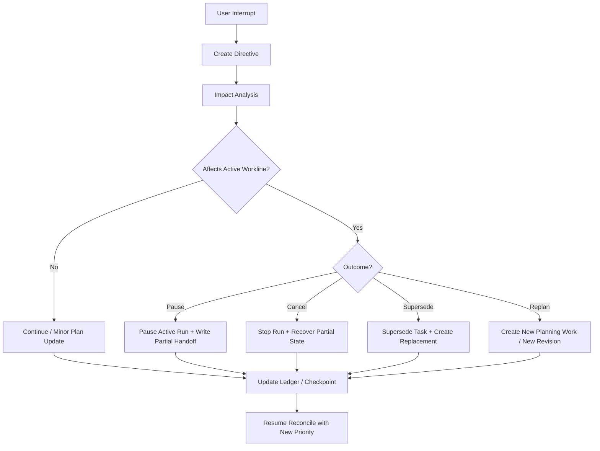

# 15 User Interrupt Replan and Preemption Protocol

## Purpose

- 定义运行中用户插话的可执行协议。
- 把 `continue / pause / cancel / supersede / replan` 从口头分类升级为带 impact analysis、active run handling、partial handoff recovery、checkpoint 更新的正式流程。
- 确保用户输入优先级高于普通 ready task 调度。

## Scope

- 本文覆盖运行中的用户插话、steering input、plan 变更、active run 处置与 followup planning。
- 本文不替代 `Directive` intake、command model 与 change-set / outbox 基础语义。
- 总览说明见 `07-Runtime-Directive-Handling.md`。

## Definitions

- `User Interrupt`：运行中的用户插话、补充约束、目标变更、优先级调整。
- `Impact Analysis`：评估用户输入对目标、范围、约束、task graph、active runs、acceptance、checkpoint 的影响。
- `Preemption`：为了响应更高优先级输入，对 active workline 进行暂停、取消、替换或重规划。
- `Task Supersession`：旧 task 被新 task 或新 revision 替代，但旧历史仍保留。
- `Partial Handoff Recovery`：对未完成 workline 已产出进度的回收、复用与重新接力过程。

## Rules

### Priority Rule

- `User Interrupt` 优先级高于普通 ready task 调度。
- 当用户插话进入系统时，Orchestrator 必须先处理 interrupt backlog，再考虑继续派发 ready tasks。

### Intake Rule

- 用户插话必须先进入 `UserInputReceived`。
- 必须形成新的 `Directive`。
- impact analysis 完成前，不得直接修改 `Task` 或 `AgentRun` 最终状态。

### Impact Analysis Rule

impact analysis 至少覆盖以下问题：

- 输入是否改变 objective / scope / constraints / priority
- 当前 active revision 是否仍成立
- 哪些 open tasks 受影响
- 哪些 active runs 受影响
- 是否需要 pause / cancel / supersede / replan
- 是否需要 partial handoff recovery
- 是否需要 followup planning
- 是否需要立即 checkpoint

### Outcome Matrix

| Outcome | 适用场景 | Task 处理 | Active Run 处理 | Handoff / Recovery 要求 | 后续动作 |
|---|---|---|---|---|---|
| `continue` | 输入不改变当前 contract，只是补充背景 | 保持不变 | 保持不变 | 记录影响分析结果 | 继续当前工作线 |
| `pause` | 需要先等待新信息或临时让路 | task 标记 `paused_pending_resume` 或等价状态 | 优先 `finish_current_step` | 必须写 checkpoint 或 partial handoff | 进入恢复点等待 resume |
| `cancel` | 当前工作已不再需要 | task 标记 `cancelled` 或 `blocked` | `soft_stop` 或 `hard_kill` | 必须记录已完成部分与回收策略 | 释放锁，更新 ledger |
| `supersede` | 当前工作仍有价值但需要被替代 | 旧 task 标记 `superseded`，新 task / revision 建立替代关系 | 停止旧 run 或让其收尾并转 partial handoff | 必须保留 supersession mapping | 生成 replacement task / contract |
| `replan` | 目标、范围或约束已显著变化 | 当前 revision 可能被 supersede | active runs 依影响决定继续、暂停或取消 | 需要汇总当前证据与未决问题 | 创建新 planning work / plan revision |

### Partial Handoff Recovery Rule

- 只要 active run 已产出有价值进度，就不得直接丢弃。
- `partial_handoff` 至少要记录：
  - 已完成内容
  - 未完成内容
  - 修改文件 / 证据引用
  - 已知风险
  - 下一轮接手建议
- 后续 replacement task 或 replan 必须显式引用该 partial handoff。

### Checkpoint Update Rule

- 以下情况必须补写 checkpoint：
  - active run 被暂停
  - task 被 supersede
  - new revision 已创建
  - partial handoff 已提交
  - interrupt 影响了 active workline

## Protocol Steps

1. 接收 `User Interrupt`。
2. 写入 `UserInputReceived` 并编译为 `Directive`。
3. 执行 impact analysis。
4. 决定 `continue / pause / cancel / supersede / replan`。
5. 处理 active runs：
   - 保持
   - finish current step
   - soft stop
   - hard kill
6. 如有进度，收集 `partial_handoff`。
7. 更新 task state、supersession mapping、followup planning、Requirement Ledger。
8. 写 checkpoint。
9. 返回 Orchestrator reconcile loop，继续调度新的 ready contracts。

## Mermaid

### 用户插话到 preemption / replan

## Anti-patterns

- 用户插话到来后仍继续按普通 ready task 优先级派发。
- 直接在聊天里改 plan，不生成 `Directive` 与 impact analysis。
- supersede 任务但不处理活跃 `AgentRun`。
- 有部分进度却不写 partial handoff，导致下一轮只能从头开始。
- 计划已改变却不更新 ledger 和 checkpoint。

## Acceptance Criteria

- 读者能明确看到用户输入优先级高于普通 ready task 调度。
- 读者能明确知道 `continue / pause / cancel / supersede / replan` 如何落到 task、run、handoff、checkpoint。
- 读者能明确知道 partial handoff recovery 与 task supersession 的处理方式。
